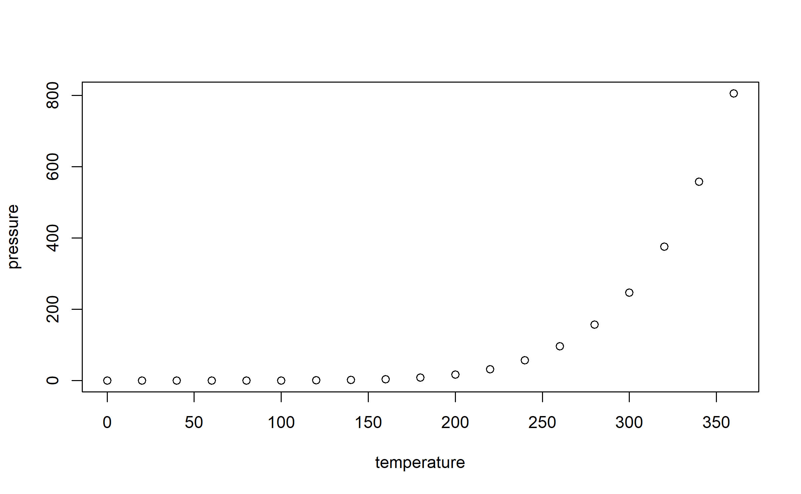

Eyetracking data
================
Tristan Mahr
2017-10-17

-   [GitHub Documents](#github-documents)
-   [Including Code](#including-code)
-   [Including Plots](#including-plots)

``` r
library(dplyr)
library(tidyr)
wide <- data_frame(
  number = c(1:3, 1:3),
  value = letters[1:6])
wide
#> # A tibble: 6 x 2
#>   number value
#>    <int> <chr>
#> 1      1     a
#> 2      2     b
#> 3      3     c
#> 4      1     d
#> 5      2     e
#> 6      3     f

long <- wide %>% 
  gather(variable, value,  -number)
long
#> # A tibble: 6 x 3
#>   number variable value
#>    <int>    <chr> <chr>
#> 1      1    value     a
#> 2      2    value     b
#> 3      3    value     c
#> 4      1    value     d
#> 5      2    value     e
#> 6      3    value     f

long %>% 
  spread(variable, value)
#> Error: Duplicate identifiers for rows (1, 4), (2, 5), (3, 6)
```

    #> # A tibble: 6 x 2
    #>   number value
    #> *  <int> <chr>
    #> 1      1     a
    #> 2      2     b
    #> 3      3     c
    #> 4      1     d
    #> 5      2     e
    #> 6      3     f
    #> # A tibble: 6 x 2
    #>   number value
    #>    <int> <chr>
    #> 1      1     d
    #> 2      2     e
    #> 3      3     f
    #> 4      1     a
    #> 5      2     b
    #> 6      3     c

GitHub Documents
----------------

This is an R Markdown format used for publishing markdown documents to GitHub. When you click the **Knit** button all R code chunks are run and a markdown file (.md) suitable for publishing to GitHub is generated.

Including Code
--------------

You can include R code in the document as follows:

``` r
summary(cars)
#>      speed           dist       
#>  Min.   : 4.0   Min.   :  2.00  
#>  1st Qu.:12.0   1st Qu.: 26.00  
#>  Median :15.0   Median : 36.00  
#>  Mean   :15.4   Mean   : 42.98  
#>  3rd Qu.:19.0   3rd Qu.: 56.00  
#>  Max.   :25.0   Max.   :120.00
```

Including Plots
---------------

You can also embed plots, for example:



Note that the `echo = FALSE` parameter was added to the code chunk to prevent printing of the R code that generated the plot.
