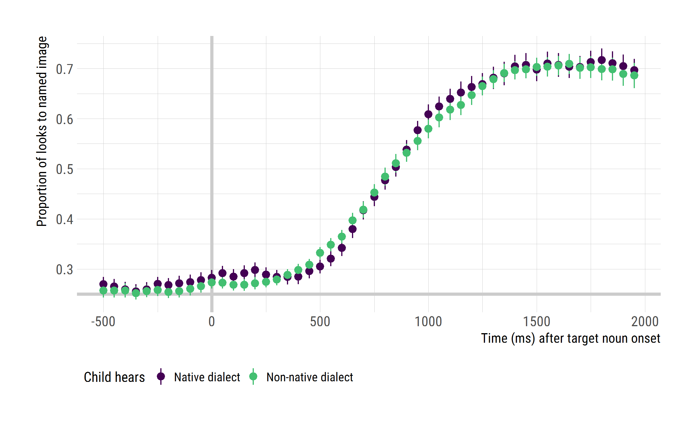
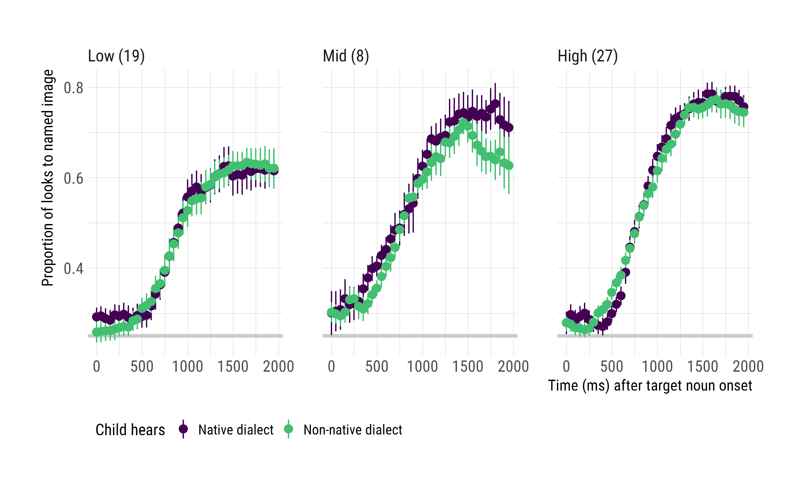
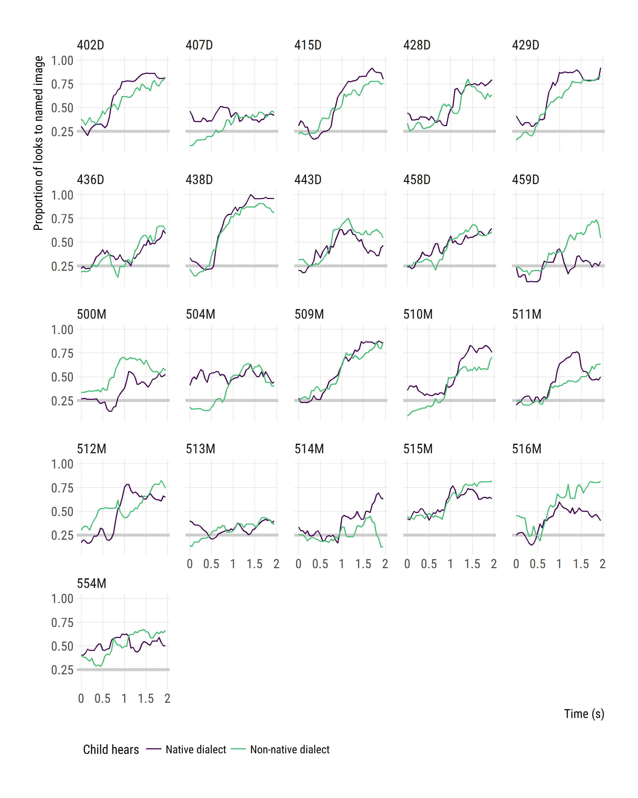
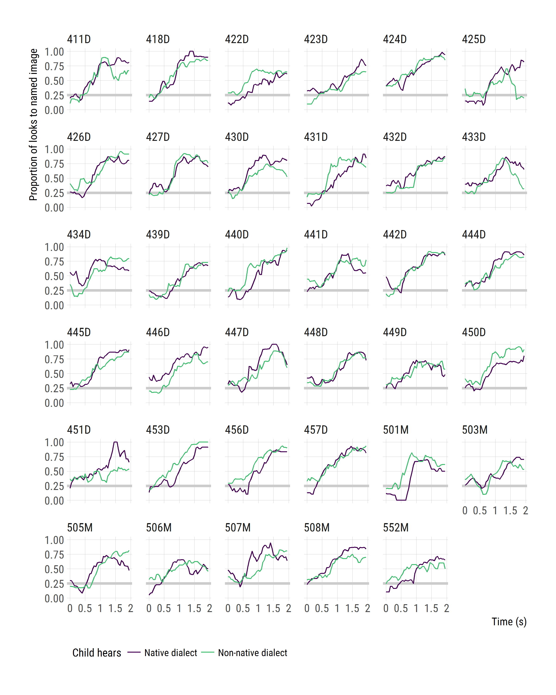

Plot eyetracking data
================
Tristan Mahr
2017-10-24

-   [Set up](#set-up)
-   [Head counts and other stats](#head-counts-and-other-stats)
-   [Aggregate looking data](#aggregate-looking-data)
-   [Finally, plots of fixation patterns over time](#finally-plots-of-fixation-patterns-over-time)
-   [Spaghetti](#spaghetti)
-   [Save data-set for modeling](#save-data-set-for-modeling)

Set up
------

``` r
library(dplyr)
library(littlelisteners)
library(ggplot2)
library(hrbrthemes)

# Work relative to RStudio project
wd <- rprojroot::find_rstudio_root_file()

df_child_vars <- readr::read_csv(file.path(wd, "data", "scores.csv"))
df_looks <- readr::read_csv(file.path(wd, "data", "screened.csv.gz"))
```

Head counts and other stats
---------------------------

Boys/girls by native dialect.

``` r
df_child_vars %>% 
  count(Dialect, Gender) %>% 
  ungroup() %>% 
  rename(`N Children` = n) %>% 
  knitr::kable()
```

| Dialect | Gender |  N Children|
|:--------|:-------|-----------:|
| AAE     | Boy    |           7|
| AAE     | Girl   |          14|
| MAE     | Boy    |          19|
| MAE     | Girl   |          16|

Maternal education by native dialect.

``` r
df_child_vars %>% 
  count(Dialect, Maternal_Education_Group) %>% 
  ungroup() %>% 
  rename(`N Children` = n) %>%   
  knitr::kable() 
```

| Dialect | Maternal\_Education\_Group |  N Children|
|:--------|:---------------------------|-----------:|
| AAE     | High                       |           1|
| AAE     | Low                        |          17|
| AAE     | Mid                        |           2|
| AAE     | NA                         |           1|
| MAE     | High                       |          26|
| MAE     | Low                        |           2|
| MAE     | Mid                        |           6|
| MAE     | NA                         |           1|

``` r

df_child_vars %>% 
  count(Dialect, Maternal_Education_Group) %>% 
  ungroup() %>% 
  tidyr::spread(Dialect, n) %>% 
  knitr::kable()
```

| Maternal\_Education\_Group |  AAE|  MAE|
|:---------------------------|----:|----:|
| High                       |    1|   26|
| Low                        |   17|    2|
| Mid                        |    2|    6|
| NA                         |    1|    1|

``` r

df_child_vars %>% 
  count(Dialect, Maternal_Education_Group, Maternal_Education) %>% 
  ungroup() %>% 
  tidyr::spread(Dialect, n) %>% 
  tidyr::replace_na(list(AAE = 0, MAE = 0)) %>% 
  knitr::kable()
```

| Maternal\_Education\_Group | Maternal\_Education          |  AAE|  MAE|
|:---------------------------|:-----------------------------|----:|----:|
| High                       | College Degree               |    1|   13|
| High                       | Graduate Degree              |    0|   13|
| Low                        | GED                          |    1|    0|
| Low                        | High School Diploma          |    7|    2|
| Low                        | Less Than High School        |    9|    0|
| Mid                        | Some College (&lt;2 years)   |    0|    1|
| Mid                        | Some College (2+ years)      |    0|    3|
| Mid                        | Technical/Associate's Degree |    2|    2|
| NA                         | NA                           |    1|    1|

Child level measures by dialect group.

``` r
narm_mean <- function(...) mean(..., na.rm = TRUE)
narm_sd <- function(...) sd(..., na.rm = TRUE)
narm_n <- function(...) sum(!is.na(...))

df_child_vars %>% 
  group_by(Dialect) %>% 
  summarise(
    `N Children` = n(), 
    sum(Female),
    `Mean Age (months)` = narm_mean(EVT_Age),
    `SD Age (months)` = narm_sd(EVT_Age),
    `N EVT` = narm_n(EVT_Raw), 
    `Mean EVT Standard` = narm_mean(EVT_Standard),
    `SD EVT Standard` = narm_sd(EVT_Standard),
    `N PPVT` = narm_n(PPVT_Raw), 
    `Mean PPVT Standard` = narm_mean(PPVT_Standard),
    `SD PPVT Standard` = narm_sd(PPVT_Standard)) %>% 
  knitr::kable(digits = 1)
```

| Dialect |  N Children|  sum(Female)|  Mean Age (months)|  SD Age (months)|  N EVT|  Mean EVT Standard|  SD EVT Standard|  N PPVT|  Mean PPVT Standard|  SD PPVT Standard|
|:--------|-----------:|------------:|------------------:|----------------:|------:|------------------:|----------------:|-------:|-------------------:|-----------------:|
| AAE     |          21|           14|               47.7|              8.0|     21|               95.6|             11.4|      21|                95.5|              10.1|
| MAE     |          35|           16|               50.8|              5.7|     34|              120.5|             14.8|      35|               120.9|              17.6|

``` r

df_child_vars %>% 
  group_by(Maternal_Education_Group) %>% 
  summarise(
    `N Children` = n(), 
    `Mean Age (months)` = narm_mean(EVT_Age),
    `SD Age (months)` = narm_sd(EVT_Age),
    `N EVT` = narm_n(EVT_Raw), 
    `Mean EVT Standard` = narm_mean(EVT_Standard),
    `SD EVT Standard` = narm_sd(EVT_Standard),
    `N PPVT` = narm_n(PPVT_Raw), 
    `Mean PPVT Standard` = narm_mean(PPVT_Standard),
    `SD PPVT Standard` = narm_sd(PPVT_Standard)) %>% 
  knitr::kable(digits = 1)
```

| Maternal\_Education\_Group |  N Children|  Mean Age (months)|  SD Age (months)|  N EVT|  Mean EVT Standard|  SD EVT Standard|  N PPVT|  Mean PPVT Standard|  SD PPVT Standard|
|:---------------------------|-----------:|------------------:|----------------:|------:|------------------:|----------------:|-------:|-------------------:|-----------------:|
| High                       |          27|               50.5|              5.7|     27|              121.3|             15.8|      27|               122.6|              13.8|
| Low                        |          19|               47.1|              6.6|     19|               96.8|             13.0|      19|                97.1|              11.3|
| Mid                        |           8|               53.4|              8.9|      7|              113.1|             15.4|       8|               107.9|              29.3|
| NA                         |           2|               48.0|             11.3|      2|               99.0|              5.7|       2|               109.5|              19.1|

``` r

df_child_vars %>% 
  group_by(Dialect, Maternal_Education_Group) %>% 
  summarise(
    `N Children` = n(), 
    `Mean Age (months)` = narm_mean(EVT_Age),
    `SD Age (months)` = narm_sd(EVT_Age),
    `N EVT` = narm_n(EVT_Raw), 
    `Mean EVT Standard` = narm_mean(EVT_Standard),
    `SD EVT Standard` = narm_sd(EVT_Standard),
    `N PPVT` = narm_n(PPVT_Raw), 
    `Mean PPVT Standard` = narm_mean(PPVT_Standard),
    `SD PPVT Standard` = narm_sd(PPVT_Standard)) %>% 
  knitr::kable(digits = 1)
```

| Dialect | Maternal\_Education\_Group |  N Children|  Mean Age (months)|  SD Age (months)|  N EVT|  Mean EVT Standard|  SD EVT Standard|  N PPVT|  Mean PPVT Standard|  SD PPVT Standard|
|:--------|:---------------------------|-----------:|------------------:|----------------:|------:|------------------:|----------------:|-------:|-------------------:|-----------------:|
| AAE     | High                       |           1|               58.0|               NA|      1|               93.0|               NA|       1|               103.0|                NA|
| AAE     | Low                        |          17|               47.0|              6.9|     17|               95.4|             12.7|      17|                95.6|              10.9|
| AAE     | Mid                        |           2|               52.0|             17.0|      2|               98.5|              2.1|       2|                91.0|               2.8|
| AAE     | NA                         |           1|               40.0|               NA|      1|               95.0|               NA|       1|                96.0|                NA|
| MAE     | High                       |          26|               50.2|              5.6|     26|              122.3|             15.0|      26|               123.3|              13.5|
| MAE     | Low                        |           2|               48.0|              1.4|      2|              109.0|             11.3|       2|               110.0|               1.4|
| MAE     | Mid                        |           6|               54.0|              6.8|      5|              119.0|             14.3|       6|               113.5|              32.4|
| MAE     | NA                         |           1|               56.0|               NA|      1|              103.0|               NA|       1|               123.0|                NA|

Home dialect predicts maternal ed. This is a recruitment artifact.

``` r
df_child_vars %>% 
  count(Dialect, Maternal_Education_Group) %>% 
  mutate(`Mat. ed.` = Maternal_Education_Group %>% 
           factor(c("Low", "Mid", "High")) ) %>% 
  select(Dialect, `Mat. ed.`, n) %>% 
  arrange(Dialect, `Mat. ed.`) %>% 
  knitr::kable()
```

| Dialect | Mat. ed. |    n|
|:--------|:---------|----:|
| AAE     | Low      |   17|
| AAE     | Mid      |    2|
| AAE     | High     |    1|
| AAE     | NA       |    1|
| MAE     | Low      |    2|
| MAE     | Mid      |    6|
| MAE     | High     |   26|
| MAE     | NA       |    1|

Maternal ed. in turn predicts vocabulary ntiles

``` r
df_child_vars %>% 
  count(Maternal_Education_Group, ntile(EVT_Standard, 3)) %>% 
  rename(`Vocab. level` = `ntile(EVT_Standard, 3)`) %>% 
  mutate(`Mat. ed.` = Maternal_Education_Group %>% 
           factor(c("Low", "Mid", "High")) ) %>% 
  select(`Mat. ed.`, `Vocab. level`, n) %>% 
  arrange(`Mat. ed.`, `Vocab. level`) %>% 
  knitr::kable()
```

| Mat. ed. |  Vocab. level|    n|
|:---------|-------------:|----:|
| Low      |             1|   13|
| Low      |             2|    5|
| Low      |             3|    1|
| Mid      |             1|    2|
| Mid      |             2|    3|
| Mid      |             3|    2|
| Mid      |            NA|    1|
| High     |             1|    3|
| High     |             2|    9|
| High     |             3|   15|
| NA       |             1|    1|
| NA       |             2|    1|

Aggregate looking data
----------------------

Define a response code for the `aggregate_looks()` function.

``` r
resp_def <- create_response_def(
  primary = "Target",
  others = c("PhonologicalFoil", "SemanticFoil", "Unrelated"),
  elsewhere = "tracked",
  missing = NA
)  
```

Assign the individual frames into 50-ms bins.

``` r
df_bin_times <- df_looks %>%  
  left_join(df_child_vars) %>% 
  mutate(BlockDialect = ifelse(BlockDialect == "AAE", "AAE", "MAE"),
         HearsNativeDialect = Dialect == BlockDialect) %>% 
  filter(between(Time, -520, 1970)) %>% 
  assign_bins(3, Time, Basename, TrialNo) %>% 
  group_by(.bin) %>% 
  mutate(BinTime = Time %>% median() %>% round(-1)) %>% 
  ungroup()
```

Aggregated looking data over Time across trials within Dialect x BlockDialect within Child.

``` r
df_looks <- df_bin_times %>%
  aggregate_looks2(resp_def = resp_def, resp_var = GazeByImageAOI, 
                   Maternal_Education_Group, Study, Dialect, BlockDialect, 
                   HearsNativeDialect, ResearchID, BinTime) %>% 
  rename(Time = BinTime) %>% 
  mutate(
    Looks_Images = Target + Others,
    Prop_Target = Target / Looks_Images,
    Prop_PhonologicalFoil = PhonologicalFoil / Looks_Images,
    Prop_SemanticFoil = SemanticFoil / Looks_Images,
    Prop_Unrelated = Unrelated / Looks_Images)
```

Add some grouping variables to the data.

``` r
fct_add_counts <- function(f) {
 counts <- forcats::fct_count(f) 
 counts[["new"]] <- sprintf("%s (%s)", counts[["f"]], counts[["n"]])
 x <- setNames(counts[["new"]], counts[["f"]])
 forcats::fct_relabel(f, function(level) x[level])
}

tertile_labels <- c("Lower third", "Middle third", "Upper third")
df_evt <- df_child_vars %>% 
  mutate(Vocab3tile = ntile(EVT_Standard, 3), 
         `Exp. vocab.` = Vocab3tile %>% 
           factor(1:3, tertile_labels) %>% 
           fct_add_counts(),
         `Maternal edu.` = Maternal_Education_Group %>% 
            factor(c("Low", "Mid", "High")) %>% 
            fct_add_counts(),
         `Native dialect` = Dialect %>% factor() %>% fct_add_counts()) %>% 
  select(Study, ResearchID, Vocab3tile, 
         `Exp. vocab.`, `Maternal edu.`, `Native dialect`,
         EVT_Standard, Maternal_Education_Group)

df_looks <- df_looks %>% 
  mutate(
    `Child hears` = ifelse(HearsNativeDialect, "Native dialect", 
                           "Non-native dialect")) %>% 
  left_join(df_evt)
```

Finally, plots of fixation patterns over time
---------------------------------------------

Set up plotting constants and helpers.

``` r
plot_text <- list(
  x_time = "Time (ms) after target noun onset", 
  y_target = "Proportion of looks to named image",
  y_image = "Proportion of looks to image",
  caption_mean_se = "Mean ± SE"
)

legend_position <- theme(
  legend.position = "bottom", 
  legend.text = element_text(size = 10), 
  legend.justification = "left")

colors <- viridis::scale_color_viridis(end = .7, discrete = TRUE)

hline_chance <- geom_hline(yintercept = .25, size = 1.25, color = "#cccccc")
vline_onset <- geom_vline(xintercept = 0, size = 1.25, color = "#cccccc")
```

``` r
ggplot(df_looks) + 
  aes(x = Time, y = Prop) +   
  hline_chance + 
  vline_onset + 
  stat_summary() + 
  theme_ipsum_rc(axis_title_size = 11) + 
  labs(x = plot_text$x_time, 
       y = plot_text$y_target, 
       caption = plot_text$caption_mean_se)
```


``` r

ggplot(df_looks) + 
  aes(x = Time, y = Prop, color = `Child hears`) + 
  hline_chance + 
  vline_onset + 
  stat_summary() + 
  colors +
  theme_ipsum_rc(axis_title_size = 11) + 
  legend_position + 
  labs(x = plot_text$x_time, 
       y = plot_text$y_target)
```



``` r

df_looks %>% 
  filter(between(Time, 0, 2000)) %>% 
  ggplot() + 
    aes(x = Time, y = Prop, color = `Child hears`) + 
    hline_chance + 
    stat_summary() + 
    facet_wrap("`Native dialect`", labeller = label_both) + 
    colors +
    theme_ipsum_rc(axis_title_size = 11) + 
    legend_position + 
    labs(x = plot_text$x_time, 
         y = plot_text$y_target)
```


``` r

df_looks %>% 
  filter(!is.na(`Exp. vocab.`)) %>% 
  filter(between(Time, 0, 2000)) %>% 
  ggplot() + 
    aes(x = Time, y = Prop, color = `Child hears`) + 
    hline_chance + 
    stat_summary() + 
    facet_wrap("`Exp. vocab.`") +
    colors +
    theme_ipsum_rc(axis_title_size = 11) + 
    legend_position + 
    labs(x = plot_text$x_time, 
         y = plot_text$y_target) 
```


``` r

df_looks %>% 
  filter(!is.na(Maternal_Education_Group)) %>% 
  filter(between(Time, 0, 2000)) %>% 
  ggplot() + 
    aes(x = Time, y = Prop, color = `Child hears`) + 
    hline_chance + 
    stat_summary() + 
    facet_wrap("`Maternal edu.`") + 
    colors +
    theme_ipsum_rc(axis_title_size = 11) + 
    legend_position + 
    labs(x = plot_text$x_time, 
         y = plot_text$y_target)
```



Spaghetti
---------

Double check the individual growth curves.

``` r
df_looks %>% 
  filter(Dialect == "AAE") %>% 
  filter(between(Time, 0, 2000)) %>% 
  ggplot() + 
    aes(x = Time, y = Prop, color = `Child hears`) + 
    hline_chance + 
    geom_line(aes(group = interaction(ResearchID, `Child hears`))) +
    facet_wrap("ResearchID") + 
    colors +
    theme_ipsum_rc(axis_title_size = 11) + 
    theme(panel.spacing.x = grid::unit(1, "lines"),
          panel.spacing.y = grid::unit(1, "lines"),
          panel.grid.minor = element_blank()) +
    legend_position +
    scale_x_continuous(labels = function(x) x / 1000) +
    labs(x = "Time (s)", 
         y = plot_text$y_target)
```



``` r

df_looks %>% 
  filter(Dialect == "MAE") %>% 
  filter(between(Time, 0, 2000)) %>% 
  ggplot() + 
    aes(x = Time, y = Prop, color = `Child hears`) + 
    hline_chance + 
    geom_line(aes(group = interaction(ResearchID, `Child hears`))) +
    facet_wrap("ResearchID") + 
    colors +
    theme_ipsum_rc(axis_title_size = 11) + 
    theme(panel.spacing.x = grid::unit(1, "lines"),
          panel.spacing.y = grid::unit(1, "lines"),
          panel.grid.minor = element_blank()) +
    legend_position +
    scale_x_continuous(labels = function(x) x / 1000) +
    labs(x = "Time (s)", 
         y = plot_text$y_target)
```



Save data-set for modeling
--------------------------

``` r
df_looks %>% 
  select(-.response_def, -Study, -PhonologicalFoil, 
         -SemanticFoil, -Unrelated, -Elsewhere, -Looks_Images, 
         -(Prop_PhonologicalFoil:Prop_Unrelated), -Vocab3tile) %>% 
  select(ResearchID, Dialect, BlockDialect, 
         HearsNativeDialect, Time, everything()) %>% 
readr::write_csv(file.path("data", "modeling.csv"))
```
