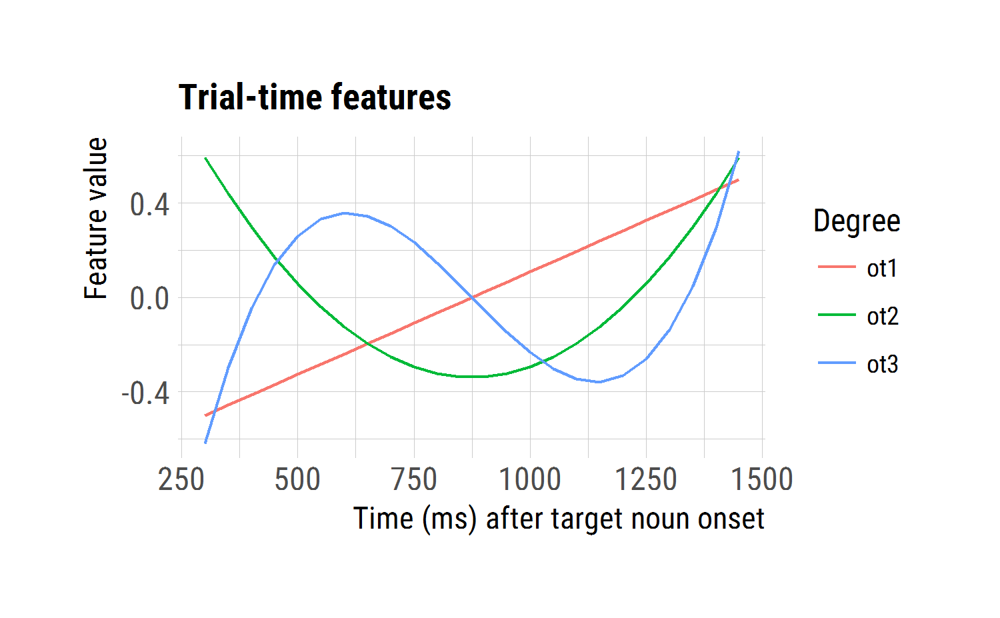

Model eyetracking data
================
Tristan Mahr
2017-10-18

-   [Setup](#setup)
-   [Growth curve models](#growth-curve-models)

Setup
-----

``` r
library(dplyr)
library(lme4)
library(ggplot2)
library(hrbrthemes)

# Work relative to RStudio project
wd <- rprojroot::find_rstudio_root_file()

d_m <- readr::read_csv(file.path(wd, "data", "modeling.csv"))
```

These are plotting settings and helpers.

``` r
stat_mean_se <- function(...) {
  stat_summary(fun.data = mean_se, ...)
}

stat_mean <- function(...) {
  dots <- list(...)
  dots$fun.y <- mean
  if (is.null(dots$geom)) dots$geom <- "line"
  do.call(stat_summary, dots)
}
  
plot_text <- list(
  x_time = "Time (ms) after target noun onset", 
  y_target = "Proportion of looks to named image",
  y_image = "Proportion of looks to image",
  caption_mean_se = "Mean ± SE"
)

legend_bottom <- theme(
  legend.position = "bottom", 
  legend.text = element_text(size = 10), 
  legend.justification = "left")

legend_top <- theme(
  legend.position = "top", 
  legend.text = element_text(size = 10), 
  legend.justification = "left")

colors <- viridis::scale_color_viridis(end = .7, discrete = TRUE)

hline_chance <- geom_hline(yintercept = .25, size = 1.25, color = "#cccccc")
vline_onset <- geom_vline(xintercept = 0, size = 1.25, color = "#cccccc")
```

Growth curve models
-------------------

Based on the [visual exploratory data analysis](./03-eyetracking-data.md), there is no average effect of hearing a non-native dialect on familiar word recognition. We need to confirm this observation through growth curve analysis.

First, we set some options for the analysis, namely the start and end time of the analysis window.

``` r
opts_gca <- list(
  min_time = 250,
  max_time = 1500
)
```

We model looks from 250 to 1500 ms.


We represent time in our growth curve models as a cubic orthogonal polynomial. This means that we convert out *Time* variable into three uncorrelated trend curves. These are the predictors we use to represent time.

``` r
# Apply analysis window and Create orthogonal polynomial of time
d_m <- d_m %>% 
  filter(opts_gca$min < Time, Time < opts_gca$max_time) %>% 
  polypoly::poly_add_columns(Time, 3, prefix = "ot", scale_width = 1)
```



We are going to use a *generalized linear mixed effects model* to perform the growth curve analysis.

``` r
glmer_controls <- glmerControl(
  optimizer = "bobyqa",
  optCtrl = list(maxfun = 2e5))

m <- glmer(
  cbind(Primary, Others) ~ 
    (ot1 + ot2 + ot3) * HearsNativeDialect + 
    (ot1 + ot2 + ot3 | ResearchID / HearsNativeDialect),
  data = d_m,
  control = glmer_controls,
  family = binomial)
summary(m)
```

``` r
glmer_controls <- glmerControl(
  optimizer = "bobyqa",
  optCtrl = list(maxfun = 2e5))

cond_omitted <- glmer(
  cbind(Primary, Others) ~ 
    (ot1 + ot2 + ot3) + 
    (ot1 + ot2 + ot3 | ResearchID),
  data = d_m, 
  control = glmer_controls,
  family = binomial)
summary(cond_omitted)
#> Generalized linear mixed model fit by maximum likelihood (Laplace
#>   Approximation) [glmerMod]
#>  Family: binomial  ( logit )
#> Formula: cbind(Primary, Others) ~ (ot1 + ot2 + ot3) + (ot1 + ot2 + ot3 |  
#>     ResearchID)
#>    Data: d_m
#> Control: glmer_controls
#> 
#>      AIC      BIC   logLik deviance df.resid 
#>  16465.0  16547.6  -8218.5  16437.0     2674 
#> 
#> Scaled residuals: 
#>     Min      1Q  Median      3Q     Max 
#> -3.8096 -0.8099 -0.0042  0.8468  4.3706 
#> 
#> Random effects:
#>  Groups     Name        Variance Std.Dev. Corr             
#>  ResearchID (Intercept) 0.15521  0.3940                    
#>             ot1         0.60292  0.7765    0.64            
#>             ot2         0.18814  0.4337   -0.16 -0.19      
#>             ot3         0.06591  0.2567   -0.20 -0.39  0.22
#> Number of obs: 2688, groups:  ResearchID, 56
#> 
#> Fixed effects:
#>             Estimate Std. Error z value Pr(>|z|)    
#> (Intercept)  0.02296    0.05295   0.434    0.665    
#> ot1          2.19384    0.10560  20.776  < 2e-16 ***
#> ot2         -0.12877    0.06106  -2.109    0.035 *  
#> ot3         -0.23904    0.03925  -6.090 1.13e-09 ***
#> ---
#> Signif. codes:  0 '***' 0.001 '**' 0.01 '*' 0.05 '.' 0.1 ' ' 1
#> 
#> Correlation of Fixed Effects:
#>     (Intr) ot1    ot2   
#> ot1  0.626              
#> ot2 -0.144 -0.182       
#> ot3 -0.172 -0.326  0.183

cond_as_fixed_eff <- glmer(
  cbind(Primary, Others) ~ 
    (ot1 + ot2 + ot3) * HearsNativeDialect + 
    (ot1 + ot2 + ot3 | ResearchID),
  data = d_m,
  control = glmer_controls,
  family = binomial)
summary(cond_as_fixed_eff)
#> Generalized linear mixed model fit by maximum likelihood (Laplace
#>   Approximation) [glmerMod]
#>  Family: binomial  ( logit )
#> Formula: 
#> cbind(Primary, Others) ~ (ot1 + ot2 + ot3) * HearsNativeDialect +  
#>     (ot1 + ot2 + ot3 | ResearchID)
#>    Data: d_m
#> Control: glmer_controls
#> 
#>      AIC      BIC   logLik deviance df.resid 
#>  16444.8  16550.9  -8204.4  16408.8     2670 
#> 
#> Scaled residuals: 
#>     Min      1Q  Median      3Q     Max 
#> -3.7655 -0.8270 -0.0084  0.8512  4.3647 
#> 
#> Random effects:
#>  Groups     Name        Variance Std.Dev. Corr             
#>  ResearchID (Intercept) 0.15533  0.3941                    
#>             ot1         0.60334  0.7768    0.64            
#>             ot2         0.18760  0.4331   -0.16 -0.19      
#>             ot3         0.06466  0.2543   -0.20 -0.39  0.21
#> Number of obs: 2688, groups:  ResearchID, 56
#> 
#> Fixed effects:
#>                            Estimate Std. Error z value Pr(>|z|)    
#> (Intercept)                 0.01757    0.05326   0.330 0.741430    
#> ot1                         2.14710    0.10733  20.004  < 2e-16 ***
#> ot2                        -0.09527    0.06383  -1.493 0.135546    
#> ot3                        -0.16126    0.04326  -3.728 0.000193 ***
#> HearsNativeDialectTRUE      0.01050    0.01112   0.945 0.344741    
#> ot1:HearsNativeDialectTRUE  0.09393    0.03807   2.467 0.013615 *  
#> ot2:HearsNativeDialectTRUE -0.06652    0.03747  -1.775 0.075887 .  
#> ot3:HearsNativeDialectTRUE -0.15483    0.03745  -4.134 3.56e-05 ***
#> ---
#> Signif. codes:  0 '***' 0.001 '**' 0.01 '*' 0.05 '.' 0.1 ' ' 1
#> 
#> Correlation of Fixed Effects:
#>             (Intr) ot1    ot2    ot3    HNDTRU o1:HND o2:HND
#> ot1          0.614                                          
#> ot2         -0.135 -0.169                                   
#> ot3         -0.157 -0.285  0.155                            
#> HrsNtvDTRUE -0.104 -0.004 -0.021  0.004                     
#> ot1:HNDTRUE -0.003 -0.177 -0.004 -0.023  0.017              
#> ot2:HNDTRUE -0.007 -0.003 -0.295 -0.006  0.070  0.007       
#> ot3:HNDTRUE  0.001 -0.010 -0.004 -0.434 -0.010  0.048  0.010

cond_as_random_eff <- m2b <- glmer(
  cbind(Primary, Others) ~ 
    (ot1 + ot2 + ot3) + 
    (ot1 + ot2 + ot3 | ResearchID / HearsNativeDialect),
  data = d_m,
  control = glmer_controls,
  family = binomial)
summary(cond_as_random_eff)
#> Generalized linear mixed model fit by maximum likelihood (Laplace
#>   Approximation) [glmerMod]
#>  Family: binomial  ( logit )
#> Formula: cbind(Primary, Others) ~ (ot1 + ot2 + ot3) + (ot1 + ot2 + ot3 |  
#>     ResearchID/HearsNativeDialect)
#>    Data: d_m
#> Control: glmer_controls
#> 
#>      AIC      BIC   logLik deviance df.resid 
#>  14322.3  14463.8  -7137.1  14274.3     2664 
#> 
#> Scaled residuals: 
#>      Min       1Q   Median       3Q      Max 
#> -2.51691 -0.39788 -0.00601  0.42764  2.92233 
#> 
#> Random effects:
#>  Groups                        Name        Variance Std.Dev. Corr       
#>  HearsNativeDialect:ResearchID (Intercept) 0.10412  0.3227              
#>                                ot1         0.56565  0.7521    0.11      
#>                                ot2         0.18255  0.4273   -0.08  0.01
#>                                ot3         0.12055  0.3472    0.02 -0.63
#>  ResearchID                    (Intercept) 0.11524  0.3395              
#>                                ot1         0.41396  0.6434    0.89      
#>                                ot2         0.12233  0.3498   -0.12 -0.30
#>                                ot3         0.01721  0.1312   -0.46 -0.12
#>       
#>       
#>       
#>       
#>   0.23
#>       
#>       
#>       
#>   0.37
#> Number of obs: 2688, groups:  
#> HearsNativeDialect:ResearchID, 112; ResearchID, 56
#> 
#> Fixed effects:
#>             Estimate Std. Error z value Pr(>|z|)    
#> (Intercept)  0.02654    0.05497   0.483   0.6292    
#> ot1          2.25601    0.11341  19.893  < 2e-16 ***
#> ot2         -0.12149    0.06488  -1.873   0.0611 .  
#> ot3         -0.24048    0.04201  -5.724 1.04e-08 ***
#> ---
#> Signif. codes:  0 '***' 0.001 '**' 0.01 '*' 0.05 '.' 0.1 ' ' 1
#> 
#> Correlation of Fixed Effects:
#>     (Intr) ot1    ot2   
#> ot1  0.595              
#> ot2 -0.093 -0.158       
#> ot3 -0.151 -0.342  0.222

cond_as_both <- glmer(
  cbind(Primary, Others) ~ 
    (ot1 + ot2 + ot3) * HearsNativeDialect + 
    (ot1 + ot2 + ot3 | ResearchID / HearsNativeDialect),
  data = d_m,
  control = glmer_controls,
  family = binomial)
summary(cond_as_both)
#> Generalized linear mixed model fit by maximum likelihood (Laplace
#>   Approximation) [glmerMod]
#>  Family: binomial  ( logit )
#> Formula: 
#> cbind(Primary, Others) ~ (ot1 + ot2 + ot3) * HearsNativeDialect +  
#>     (ot1 + ot2 + ot3 | ResearchID/HearsNativeDialect)
#>    Data: d_m
#> Control: glmer_controls
#> 
#>      AIC      BIC   logLik deviance df.resid 
#>  14326.1  14491.2  -7135.1  14270.1     2660 
#> 
#> Scaled residuals: 
#>      Min       1Q   Median       3Q      Max 
#> -2.50109 -0.40113 -0.00743  0.43700  2.93517 
#> 
#> Random effects:
#>  Groups                        Name        Variance Std.Dev. Corr       
#>  HearsNativeDialect:ResearchID (Intercept) 0.10418  0.3228              
#>                                ot1         0.54881  0.7408    0.10      
#>                                ot2         0.18155  0.4261   -0.08  0.03
#>                                ot3         0.11319  0.3364    0.03 -0.62
#>  ResearchID                    (Intercept) 0.11517  0.3394              
#>                                ot1         0.41812  0.6466    0.89      
#>                                ot2         0.12250  0.3500   -0.12 -0.31
#>                                ot3         0.01885  0.1373   -0.47 -0.15
#>       
#>       
#>       
#>       
#>   0.21
#>       
#>       
#>       
#>   0.37
#> Number of obs: 2688, groups:  
#> HearsNativeDialect:ResearchID, 112; ResearchID, 56
#> 
#> Fixed effects:
#>                            Estimate Std. Error z value Pr(>|z|)    
#> (Intercept)                 0.02139    0.06312   0.339  0.73467    
#> ot1                         2.14375    0.13436  15.955  < 2e-16 ***
#> ot2                        -0.10447    0.07866  -1.328  0.18411    
#> ot3                        -0.16798    0.05568  -3.017  0.00255 ** 
#> HearsNativeDialectTRUE      0.01022    0.06212   0.165  0.86927    
#> ot1:HearsNativeDialectTRUE  0.22416    0.14578   1.538  0.12414    
#> ot2:HearsNativeDialectTRUE -0.03417    0.08965  -0.381  0.70310    
#> ot3:HearsNativeDialectTRUE -0.14514    0.07452  -1.948  0.05145 .  
#> ---
#> Signif. codes:  0 '***' 0.001 '**' 0.01 '*' 0.05 '.' 0.1 ' ' 1
#> 
#> Correlation of Fixed Effects:
#>             (Intr) ot1    ot2    ot3    HNDTRU o1:HND o2:HND
#> ot1          0.465                                          
#> ot2         -0.085 -0.102                                   
#> ot3         -0.094 -0.396  0.201                            
#> HrsNtvDTRUE -0.492 -0.054  0.036 -0.017                     
#> ot1:HNDTRUE -0.049 -0.540 -0.014  0.336  0.100              
#> ot2:HNDTRUE  0.031 -0.013 -0.566 -0.113 -0.060  0.025       
#> ot3:HNDTRUE -0.012  0.273 -0.096 -0.665  0.026 -0.500  0.169
```

Use a model comparison on the four variants.

``` r
anova_results <- anova(cond_omitted, cond_as_fixed_eff, 
                       cond_as_random_eff, cond_as_both) %>% 
  as.data.frame() %>% 
  tibble::rownames_to_column("model") %>% 
  as_data_frame()

anova_results %>% 
  select(-deviance) %>% 
  mutate_at(c("AIC", "BIC", "logLik"), round) %>% 
  mutate_at("Chisq", round, 2) %>% 
  mutate_at("Pr(>Chisq)", round, 4) %>% 
  knitr::kable()
```

| model                 |   Df|    AIC|    BIC|  logLik|    Chisq|  Chi Df|  Pr(&gt;Chisq)|
|:----------------------|----:|------:|------:|-------:|--------:|-------:|--------------:|
| cond\_omitted         |   14|  16465|  16548|   -8219|       NA|      NA|             NA|
| cond\_as\_fixed\_eff  |   18|  16445|  16551|   -8204|    28.25|       4|         0.0000|
| cond\_as\_random\_eff |   24|  14322|  14464|   -7137|  2134.51|       6|         0.0000|
| cond\_as\_both        |   28|  14326|  14491|   -7135|     4.14|       4|         0.3868|

This is kind of unusual. All of the model comparison metrics favor the model that includes Child x Native Dialect random effects but omits the Native Dialect fixed effects. My interpretation:

1.  For each child, we have two growth curves: The data from hearing their native dialect and the data from hearing the non-native dialect. Their data is *nested* in these two kinds of blocks.
2.  This variability is important for the model, so we include it in the random effects.
3.  But on average, hearing one's native dialect or not does not influence the growth curve features in a systematic way. So we can ignore using condition as a predictor.
4.  When we include that native dialect in the model's random effects, we are incorporating information about the nesting of the data. Instead of capturing Child x Native Dialect effects, it seems like the random effects are capturing Child x Block of Testing variability.

``` r
d_m_narrow <- d_m %>% 
  filter(!is.na(EVT_Standard), !is.na(Maternal_Education_Group))

m4 <- glmer(
  cbind(Primary, Others) ~ 
    (1 + ot1) * scale(EVT_Standard) + ot2 + ot3 +
    (ot1 + ot2 + ot3 | ResearchID / HearsNativeDialect),
  data = d_m_narrow,
  control = glmer_controls,
  family = binomial)
summary(m4)

m5 <- glmer(
  cbind(Primary, Others) ~ 
    (1 + ot1) * Dialect + ot2 + ot3 +
    (ot1 + ot2 + ot3 | ResearchID / HearsNativeDialect),
  data = d_m_narrow,
  control = glmer_controls,
  family = binomial)
summary(m5)

m6 <- glmer(
  cbind(Primary, Others) ~ 
    (1 + ot1) * Dialect + (1 + ot1) * scale(EVT_Standard) + ot2 + ot3 +
    (ot1 + ot2 + ot3 | ResearchID / HearsNativeDialect),
  data = d_m_narrow,
  control = glmer_controls,
  family = binomial)
summary(m6)

m7 <- glmer(
  cbind(Primary, Others) ~ 
    (1 + ot1) * Maternal_Education_Group + ot2 + ot3 +
    (ot1 + ot2 + ot3 | ResearchID / HearsNativeDialect),
  data = d_m_narrow,
  control = glmer_controls,
  family = binomial)
summary(m7)

anova(m4, m5)


anova(m, m2, m2b, m3)
anova(m, m2b, m3)
anova(m, m2b)
anova(m, m2b, m2)
anova(m, m2b, m2, m4b)
```
