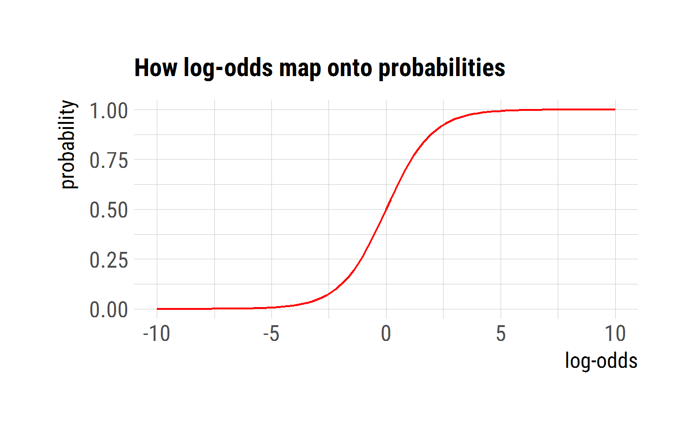
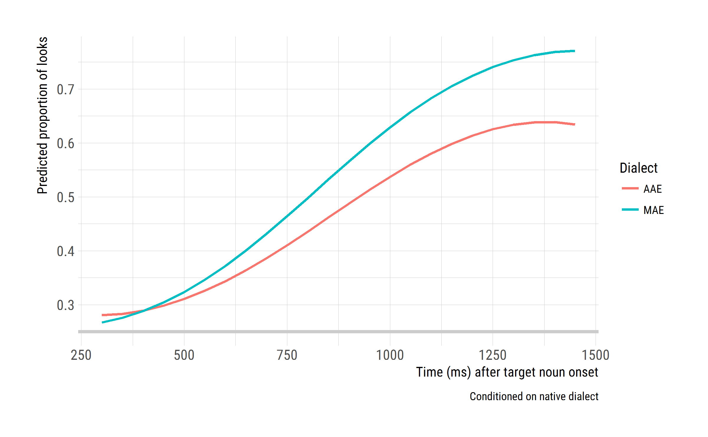

Model eyetracking data
================
Tristan Mahr
2017-10-22

-   [Setup](#setup)
-   [Growth curve models prep](#growth-curve-models-prep)
    -   [Set analysis window](#set-analysis-window)
    -   [Extract orthogonal polynomials](#extract-orthogonal-polynomials)
    -   [Model description](#model-description)
        -   ["Generalized linear"](#generalized-linear)
        -   ["Mixed effects"](#mixed-effects)
-   [Evaluate the condition effect](#evaluate-the-condition-effect)
-   [Include child-level predictors](#include-child-level-predictors)
    -   [Data preparation](#data-preparation)
    -   [EVT and Dialect effects](#evt-and-dialect-effects)
        -   [Model comparison](#model-comparison)
    -   [Include Maternal education](#include-maternal-education)
        -   [Model comparison](#model-comparison-1)
        -   [Model fits](#model-fits)
-   [Maternal education](#maternal-education)
-   [Findings](#findings)

Setup
-----

``` r
library(dplyr)
library(lme4)
library(ggplot2)
library(hrbrthemes)

# Work relative to RStudio project
wd <- rprojroot::find_rstudio_root_file()
d_m <- readr::read_csv(file.path(wd, "data", "modeling.csv"))
```

Growth curve models prep
------------------------

Based on the [visual exploratory data analysis](./03-eyetracking-data.md), there is no average effect of hearing a non-native dialect on familiar word recognition. We need to confirm this observation through growth curve analysis.

### Set analysis window

First, we set some options for the analysis, namely the start and end time of the analysis window.

``` r
opts_gca <- list(
  min_time = 250,
  max_time = 1500
)
```

We model looks from 250 to 1500 ms.


### Extract orthogonal polynomials

We represent time in our growth curve models as a cubic orthogonal polynomial. This means that we convert our *Time* variable into three uncorrelated trend curves. These are the predictors we use to represent time. I wrote an R package for dealing with orthogonal polynomials, and I have a [blog post discussing their use in growth curve models](https://tjmahr.github.io/polypoly-package-released/).

``` r
# Apply analysis window and create orthogonal polynomial of time
d_m <- d_m %>% 
  filter(opts_gca$min < Time, Time < opts_gca$max_time) %>% 
  polypoly::poly_add_columns(Time, 3, prefix = "ot", scale_width = 1)
```


### Model description

We are going to use a *generalized linear mixed effects model* to perform the growth curve analysis. I'll try to summarize what this means very briefly, but Mirman's 2014 book is the standard reference on the topic.

#### "Generalized linear"

We assume that the data is generated by a binomial process, where the number of sucesses (looks to target) depends on the total number of attempts (the number of looks) and the probability of sucess (fixating on the target). This process assumption shows up in the `glmer()` call as `family = binomial`. The number of successes and number of attempts show up in the `glmer()` formula with response variable `cbind(Primary, Others)`: The number of looks to the primary AOI (target) versus the number of looks to the others.

Our linear model estimates the probability part of the binomial process: At each time step, what is probability of fixating on the target image? If the linear trend is positive, then this probability of success increases over the course of the trial. If the condition effect is negative, then the average probability in one condition is smaller than in the other. But probabilities have a range from 0 to 1, but linear models run on the range of plus-minus infinity. We need a transformation to get from probability land to linear land and back again. This is the log-odds or logit transformation (from probability to linear) and the logistic transformation (from linear back to probability). These two are the basis for logistic regression.



Instead of modeling the probability of looking to target, we model the log-odds of looking to target. This transformation lets us *generalize* our linear model into probability land and to model data from a binomial process.

#### "Mixed effects"

I have an [extensive blog post](https://tjmahr.github.io/plotting-partial-pooling-in-mixed-effects-models/) illustrating what mixed effects models do, so I'll address their specific role here. We are going to assume that each child's growth curve is drawn from a distribution of related growth curves. We are also going to assume that each child's growth curve in each condition is also drawn from a distribution of related curves. Each child's growth curve is a combination of:

1.  An average growth curve: `... ~ ot1 + ot2 + ot3 + ...`
2.  Plus a child's general growth curve features: `... ~ ... + (ot1 + ot2 + ot3 | ResearchID)`
3.  Plus a child's specific growth curve features in each condition: `... ~ ... + (ot1 + ot2 + ot3 | HearsOwnDialect:ResearchID)`

The first recognizes that there is an average kind of performance across all children. The second captures how a child will perform similarly on both conditions, so it's like a child's *latent* growth curve shape. The third captures specific condition level variability, so it's like a child's *observed* growth curve shape. In the formulas below, the shorthand `(ot1 + ot2 + ot3 | ResearchID / HearsNativeDialect)` does both (2) and (3) with the x-has-y-nested-in-it operator `x / y`.

Evaluate the condition effect
-----------------------------

First, we need to assess the condition effect. We try four models:

1.  Entirely omit condition.
2.  Add condition as a fixed effect, so it shapes the average growth curve.
3.  Add condition as a random effect but not as a fixed, so it captures each child's condition-level variability.
4.  Add condition as both, so that we capture condition-level variability within children but also estimate the effect of condition on the average growth curve shape.

``` r
glmer_controls <- glmerControl(
  optimizer = "bobyqa",
  optCtrl = list(maxfun = 2e5))

cond_omitted <- glmer(
  cbind(Primary, Others) ~ 
    (ot1 + ot2 + ot3) + 
    (ot1 + ot2 + ot3 | ResearchID),
  data = d_m, 
  control = glmer_controls,
  family = binomial)
summary(cond_omitted)
#> Generalized linear mixed model fit by maximum likelihood (Laplace Approximation) ['glmerMod']
#>  Family: binomial  ( logit )
#> Formula: cbind(Primary, Others) ~ (ot1 + ot2 + ot3) + (ot1 + ot2 + ot3 |      ResearchID)
#>    Data: d_m
#> Control: glmer_controls
#> 
#>      AIC      BIC   logLik deviance df.resid 
#>  16465.0  16547.6  -8218.5  16437.0     2674 
#> 
#> Scaled residuals: 
#>     Min      1Q  Median      3Q     Max 
#> -3.8096 -0.8099 -0.0042  0.8468  4.3706 
#> 
#> Random effects:
#>  Groups     Name        Variance Std.Dev. Corr             
#>  ResearchID (Intercept) 0.15521  0.3940                    
#>             ot1         0.60292  0.7765    0.64            
#>             ot2         0.18814  0.4337   -0.16 -0.19      
#>             ot3         0.06591  0.2567   -0.20 -0.39  0.22
#> Number of obs: 2688, groups:  ResearchID, 56
#> 
#> Fixed effects:
#>             Estimate Std. Error z value Pr(>|z|)    
#> (Intercept)  0.02296    0.05295   0.434    0.665    
#> ot1          2.19384    0.10560  20.776  < 2e-16 ***
#> ot2         -0.12877    0.06106  -2.109    0.035 *  
#> ot3         -0.23904    0.03925  -6.090 1.13e-09 ***
#> ---
#> Signif. codes:  0 '***' 0.001 '**' 0.01 '*' 0.05 '.' 0.1 ' ' 1
#> 
#> Correlation of Fixed Effects:
#>     (Intr) ot1    ot2   
#> ot1  0.626              
#> ot2 -0.144 -0.182       
#> ot3 -0.172 -0.326  0.183

cond_as_fixed_eff <- glmer(
  cbind(Primary, Others) ~ 
    (ot1 + ot2 + ot3) * HearsNativeDialect + 
    (ot1 + ot2 + ot3 | ResearchID),
  data = d_m,
  control = glmer_controls,
  family = binomial)
summary(cond_as_fixed_eff)
#> Generalized linear mixed model fit by maximum likelihood (Laplace Approximation) ['glmerMod']
#>  Family: binomial  ( logit )
#> Formula: cbind(Primary, Others) ~ (ot1 + ot2 + ot3) * HearsNativeDialect +  
#>     (ot1 + ot2 + ot3 | ResearchID)
#>    Data: d_m
#> Control: glmer_controls
#> 
#>      AIC      BIC   logLik deviance df.resid 
#>  16444.8  16550.9  -8204.4  16408.8     2670 
#> 
#> Scaled residuals: 
#>     Min      1Q  Median      3Q     Max 
#> -3.7655 -0.8270 -0.0084  0.8512  4.3647 
#> 
#> Random effects:
#>  Groups     Name        Variance Std.Dev. Corr             
#>  ResearchID (Intercept) 0.15533  0.3941                    
#>             ot1         0.60334  0.7768    0.64            
#>             ot2         0.18760  0.4331   -0.16 -0.19      
#>             ot3         0.06466  0.2543   -0.20 -0.39  0.21
#> Number of obs: 2688, groups:  ResearchID, 56
#> 
#> Fixed effects:
#>                            Estimate Std. Error z value Pr(>|z|)    
#> (Intercept)                 0.01757    0.05326   0.330 0.741430    
#> ot1                         2.14710    0.10733  20.004  < 2e-16 ***
#> ot2                        -0.09527    0.06383  -1.493 0.135546    
#> ot3                        -0.16126    0.04326  -3.728 0.000193 ***
#> HearsNativeDialectTRUE      0.01050    0.01112   0.945 0.344741    
#> ot1:HearsNativeDialectTRUE  0.09393    0.03807   2.467 0.013615 *  
#> ot2:HearsNativeDialectTRUE -0.06652    0.03747  -1.775 0.075887 .  
#> ot3:HearsNativeDialectTRUE -0.15483    0.03745  -4.134 3.56e-05 ***
#> ---
#> Signif. codes:  0 '***' 0.001 '**' 0.01 '*' 0.05 '.' 0.1 ' ' 1
#> 
#> Correlation of Fixed Effects:
#>             (Intr) ot1    ot2    ot3    HNDTRU o1:HND o2:HND
#> ot1          0.614                                          
#> ot2         -0.135 -0.169                                   
#> ot3         -0.157 -0.285  0.155                            
#> HrsNtvDTRUE -0.104 -0.004 -0.021  0.004                     
#> ot1:HNDTRUE -0.003 -0.177 -0.004 -0.023  0.017              
#> ot2:HNDTRUE -0.007 -0.003 -0.295 -0.006  0.070  0.007       
#> ot3:HNDTRUE  0.001 -0.010 -0.004 -0.434 -0.010  0.048  0.010

cond_as_random_eff <- m2b <- glmer(
  cbind(Primary, Others) ~ 
    (ot1 + ot2 + ot3) + 
    (ot1 + ot2 + ot3 | ResearchID / HearsNativeDialect),
  data = d_m,
  control = glmer_controls,
  family = binomial)
summary(cond_as_random_eff)
#> Generalized linear mixed model fit by maximum likelihood (Laplace Approximation) ['glmerMod']
#>  Family: binomial  ( logit )
#> Formula: cbind(Primary, Others) ~ (ot1 + ot2 + ot3) + (ot1 + ot2 + ot3 |  
#>     ResearchID/HearsNativeDialect)
#>    Data: d_m
#> Control: glmer_controls
#> 
#>      AIC      BIC   logLik deviance df.resid 
#>  14322.3  14463.8  -7137.1  14274.3     2664 
#> 
#> Scaled residuals: 
#>      Min       1Q   Median       3Q      Max 
#> -2.51691 -0.39788 -0.00601  0.42764  2.92233 
#> 
#> Random effects:
#>  Groups                        Name        Variance Std.Dev. Corr             
#>  HearsNativeDialect:ResearchID (Intercept) 0.10412  0.3227                    
#>                                ot1         0.56565  0.7521    0.11            
#>                                ot2         0.18255  0.4273   -0.08  0.01      
#>                                ot3         0.12055  0.3472    0.02 -0.63  0.23
#>  ResearchID                    (Intercept) 0.11524  0.3395                    
#>                                ot1         0.41396  0.6434    0.89            
#>                                ot2         0.12233  0.3498   -0.12 -0.30      
#>                                ot3         0.01721  0.1312   -0.46 -0.12  0.37
#> Number of obs: 2688, groups:  HearsNativeDialect:ResearchID, 112; ResearchID, 56
#> 
#> Fixed effects:
#>             Estimate Std. Error z value Pr(>|z|)    
#> (Intercept)  0.02654    0.05497   0.483   0.6292    
#> ot1          2.25601    0.11341  19.893  < 2e-16 ***
#> ot2         -0.12149    0.06488  -1.873   0.0611 .  
#> ot3         -0.24048    0.04201  -5.724 1.04e-08 ***
#> ---
#> Signif. codes:  0 '***' 0.001 '**' 0.01 '*' 0.05 '.' 0.1 ' ' 1
#> 
#> Correlation of Fixed Effects:
#>     (Intr) ot1    ot2   
#> ot1  0.595              
#> ot2 -0.093 -0.158       
#> ot3 -0.151 -0.342  0.222

cond_as_both <- glmer(
  cbind(Primary, Others) ~ 
    (ot1 + ot2 + ot3) * HearsNativeDialect + 
    (ot1 + ot2 + ot3 | ResearchID / HearsNativeDialect),
  data = d_m,
  control = glmer_controls,
  family = binomial)
summary(cond_as_both)
#> Generalized linear mixed model fit by maximum likelihood (Laplace Approximation) ['glmerMod']
#>  Family: binomial  ( logit )
#> Formula: cbind(Primary, Others) ~ (ot1 + ot2 + ot3) * HearsNativeDialect +  
#>     (ot1 + ot2 + ot3 | ResearchID/HearsNativeDialect)
#>    Data: d_m
#> Control: glmer_controls
#> 
#>      AIC      BIC   logLik deviance df.resid 
#>  14326.1  14491.2  -7135.1  14270.1     2660 
#> 
#> Scaled residuals: 
#>      Min       1Q   Median       3Q      Max 
#> -2.50109 -0.40113 -0.00743  0.43700  2.93517 
#> 
#> Random effects:
#>  Groups                        Name        Variance Std.Dev. Corr             
#>  HearsNativeDialect:ResearchID (Intercept) 0.10418  0.3228                    
#>                                ot1         0.54881  0.7408    0.10            
#>                                ot2         0.18155  0.4261   -0.08  0.03      
#>                                ot3         0.11319  0.3364    0.03 -0.62  0.21
#>  ResearchID                    (Intercept) 0.11517  0.3394                    
#>                                ot1         0.41812  0.6466    0.89            
#>                                ot2         0.12250  0.3500   -0.12 -0.31      
#>                                ot3         0.01885  0.1373   -0.47 -0.15  0.37
#> Number of obs: 2688, groups:  HearsNativeDialect:ResearchID, 112; ResearchID, 56
#> 
#> Fixed effects:
#>                            Estimate Std. Error z value Pr(>|z|)    
#> (Intercept)                 0.02139    0.06312   0.339  0.73467    
#> ot1                         2.14375    0.13436  15.955  < 2e-16 ***
#> ot2                        -0.10447    0.07866  -1.328  0.18411    
#> ot3                        -0.16798    0.05568  -3.017  0.00255 ** 
#> HearsNativeDialectTRUE      0.01022    0.06212   0.165  0.86927    
#> ot1:HearsNativeDialectTRUE  0.22416    0.14578   1.538  0.12414    
#> ot2:HearsNativeDialectTRUE -0.03417    0.08965  -0.381  0.70310    
#> ot3:HearsNativeDialectTRUE -0.14514    0.07452  -1.948  0.05145 .  
#> ---
#> Signif. codes:  0 '***' 0.001 '**' 0.01 '*' 0.05 '.' 0.1 ' ' 1
#> 
#> Correlation of Fixed Effects:
#>             (Intr) ot1    ot2    ot3    HNDTRU o1:HND o2:HND
#> ot1          0.465                                          
#> ot2         -0.085 -0.102                                   
#> ot3         -0.094 -0.396  0.201                            
#> HrsNtvDTRUE -0.492 -0.054  0.036 -0.017                     
#> ot1:HNDTRUE -0.049 -0.540 -0.014  0.336  0.100              
#> ot2:HNDTRUE  0.031 -0.013 -0.566 -0.113 -0.060  0.025       
#> ot3:HNDTRUE -0.012  0.273 -0.096 -0.665  0.026 -0.500  0.169
```

Use a model comparison on the four variants.

| model                 |   Df|    AIC|    BIC|  logLik|    Chisq|  Chi Df|  Pr(&gt;Chisq)|
|:----------------------|----:|------:|------:|-------:|--------:|-------:|--------------:|
| cond\_omitted         |   14|  16465|  16548|   -8219|       NA|      NA|             NA|
| cond\_as\_fixed\_eff  |   18|  16445|  16551|   -8204|    28.25|       4|         0.0000|
| cond\_as\_random\_eff |   24|  14322|  14464|   -7137|  2134.51|       6|         0.0000|
| cond\_as\_both        |   28|  14326|  14491|   -7135|     4.14|       4|         0.3868|

This is kind of unusual. All of the model comparison metrics favor the model that includes Child x Native Dialect random effects but omits the Native Dialect fixed effects. My interpretation:

-   For each child, we have two growth curves: The data from hearing their native dialect and the data from hearing the non-native dialect. Their data is *nested* in these two kinds of blocks.
-   This variability is really important for the model, so we include it in the random effects.
-   But on average, hearing one's native dialect or not does not influence the growth curve features in a systematic way. So we can ignore using dialect condition as a predictor.
-   When we include that native dialect in the model's random effects, we are incorporating information about the nesting of the data. Instead of capturing Child x Native-Dialect effects, it seems like the random effects are capturing Child x Block-of-Testing variability.

Include child-level predictors
------------------------------

### Data preparation

First, we remove the few participants without EVT or Maternal Education data.

``` r
to_remove <- d_m %>% 
  filter(is.na(EVT_Standard) | is.na(Maternal_Education_Group)) %>% 
  select(ResearchID, Dialect, Maternal_Education_Group, EVT_Standard) %>% 
  distinct()
to_remove
#> # A tibble: 3 x 4
#>   ResearchID Dialect Maternal_Education_Group EVT_Standard
#>        <chr>   <chr>                    <chr>        <int>
#> 1       552M     MAE                      Mid           NA
#> 2       459D     AAE                     <NA>           95
#> 3       440D     MAE                     <NA>          103
```

For these models, we are going to have the predictor variables interact with the intercept term and the linear term, so that the model captures how expressive vocabulary affects overall accuracy and the slope of the growth curve. We also scale EVT so that it has a mean of 0 and a standard deviation of 1, so that a unit change in the EVT predictor represents a 1 standard deviation change in vocabulary size. We also set maternal education so the mid group is the reference group.

``` r
d_narrow <- anti_join(d_m, to_remove) %>% 
  mutate(EVTc = scale(EVT_Standard) %>% as.vector(),
         Medu = factor(Maternal_Education_Group, c("Mid", "Low", "High")))
```

To summarise these measures

``` r
d_narrow %>% 
  distinct(ResearchID, Medu, EVT_Standard, EVTc, Dialect) %>% 
  group_by(Dialect) %>% 
  summarise(n = n(),
            EVT = mean(EVT_Standard) %>% round(),
            EVT_sd = sd(EVT_Standard) %>% round(),
            EVT_scale = mean(EVTc) %>% round(2),
            EVT_scale_sd = sd(EVTc) %>% round(2),
            Min_EVT = min(EVT_Standard),
            Max_EVT = max(EVT_Standard)) %>% 
  ungroup() %>% 
  knitr::kable()
```

| Dialect |    n|  EVT|  EVT\_sd|  EVT\_scale|  EVT\_scale\_sd|  Min\_EVT|  Max\_EVT|
|:--------|----:|----:|--------:|-----------:|---------------:|---------:|---------:|
| AAE     |   20|   96|       12|       -0.87|            0.64|        67|       121|
| MAE     |   33|  121|       15|        0.53|            0.81|        92|       147|

``` r

d_narrow %>% 
  distinct(ResearchID, Medu, EVT_Standard, EVTc, Dialect) %>% 
  group_by(Dialect, Medu) %>% 
  summarise(n = n(),
            EVT = mean(EVT_Standard) %>% round(),
            EVT_sd = sd(EVT_Standard) %>% round(),
            EVT_scale = mean(EVTc) %>% round(2),
            EVT_scale_sd = sd(EVTc) %>% round(2),
            Min_EVT = min(EVT_Standard),
            Max_EVT = max(EVT_Standard)) %>% 
  ungroup() %>% 
  knitr::kable()
```

| Dialect | Medu |    n|  EVT|  EVT\_sd|  EVT\_scale|  EVT\_scale\_sd|  Min\_EVT|  Max\_EVT|
|:--------|:-----|----:|----:|--------:|-----------:|---------------:|---------:|---------:|
| AAE     | Mid  |    2|   98|        2|       -0.71|            0.12|        97|       100|
| AAE     | Low  |   17|   95|       13|       -0.88|            0.70|        67|       121|
| AAE     | High |    1|   93|      NaN|       -1.01|             NaN|        93|        93|
| MAE     | Mid  |    5|  119|       14|        0.42|            0.78|       107|       137|
| MAE     | Low  |    2|  109|       11|       -0.13|            0.62|       101|       117|
| MAE     | High |   26|  122|       15|        0.60|            0.82|        92|       147|

### EVT and Dialect effects

First we model the effect of EVT.

``` r
m_evt <- glmer(
  cbind(Primary, Others) ~ 
    (1 + ot1) * EVTc + ot2 + ot3 +
    (ot1 + ot2 + ot3 | ResearchID / HearsNativeDialect),
  data = d_narrow,
  control = glmer_controls,
  family = binomial)
summary(m_evt)
#> Generalized linear mixed model fit by maximum likelihood (Laplace Approximation) ['glmerMod']
#>  Family: binomial  ( logit )
#> Formula: cbind(Primary, Others) ~ (1 + ot1) * EVTc + ot2 + ot3 + (ot1 +  
#>     ot2 + ot3 | ResearchID/HearsNativeDialect)
#>    Data: d_narrow
#> Control: glmer_controls
#> 
#>      AIC      BIC   logLik deviance df.resid 
#>  13574.2  13726.1  -6761.1  13522.2     2518 
#> 
#> Scaled residuals: 
#>      Min       1Q   Median       3Q      Max 
#> -2.52685 -0.39297 -0.00563  0.42878  2.90126 
#> 
#> Random effects:
#>  Groups                        Name        Variance Std.Dev. Corr             
#>  HearsNativeDialect:ResearchID (Intercept) 0.10123  0.3182                    
#>                                ot1         0.57164  0.7561    0.15            
#>                                ot2         0.17790  0.4218   -0.07 -0.04      
#>                                ot3         0.12826  0.3581    0.02 -0.62  0.28
#>  ResearchID                    (Intercept) 0.08611  0.2934                    
#>                                ot1         0.29907  0.5469    0.88            
#>                                ot2         0.12784  0.3575   -0.21 -0.28      
#>                                ot3         0.01348  0.1161   -0.08  0.28  0.50
#> Number of obs: 2544, groups:  HearsNativeDialect:ResearchID, 106; ResearchID, 53
#> 
#> Fixed effects:
#>             Estimate Std. Error z value Pr(>|z|)    
#> (Intercept)  0.04940    0.05115   0.966  0.33413    
#> ot1          2.26364    0.10710  21.136  < 2e-16 ***
#> EVTc         0.14806    0.05223   2.835  0.00459 ** 
#> ot2         -0.09941    0.06709  -1.482  0.13845    
#> ot3         -0.25403    0.04316  -5.886 3.96e-09 ***
#> ot1:EVTc     0.29493    0.10581   2.787  0.00531 ** 
#> ---
#> Signif. codes:  0 '***' 0.001 '**' 0.01 '*' 0.05 '.' 0.1 ' ' 1
#> 
#> Correlation of Fixed Effects:
#>          (Intr) ot1    EVTc   ot2    ot3   
#> ot1       0.548                            
#> EVTc      0.000  0.002                     
#> ot2      -0.143 -0.162  0.005              
#> ot3      -0.016 -0.264  0.000  0.277       
#> ot1:EVTc  0.001  0.003  0.564  0.006  0.009
```

This model tells us that increasing expressive vocabulary by 1 SD improves overall accuracy and processing efficiency. This is entirely as expected.


Now we include the child's native dialect as a predictor of accuracy and processing efficieny. We also allow dialect to interact with vocabulary size. Because the two groups of children differ in the vocabulary levels, we expect one of the features to be redundant.

``` r
m_dialect <- glmer(
  cbind(Primary, Others) ~ 
    (1 + ot1) * Dialect + ot2 + ot3 +
    (ot1 + ot2 + ot3 | ResearchID / HearsNativeDialect),
  data = d_narrow,
  control = glmer_controls,
  family = binomial)
summary(m_dialect)
#> Generalized linear mixed model fit by maximum likelihood (Laplace Approximation) ['glmerMod']
#>  Family: binomial  ( logit )
#> Formula: cbind(Primary, Others) ~ (1 + ot1) * Dialect + ot2 + ot3 + (ot1 +  
#>     ot2 + ot3 | ResearchID/HearsNativeDialect)
#>    Data: d_narrow
#> Control: glmer_controls
#> 
#>      AIC      BIC   logLik deviance df.resid 
#>  13571.0  13722.8  -6759.5  13519.0     2518 
#> 
#> Scaled residuals: 
#>      Min       1Q   Median       3Q      Max 
#> -2.51967 -0.39568 -0.00677  0.42617  2.91237 
#> 
#> Random effects:
#>  Groups                        Name        Variance Std.Dev. Corr             
#>  HearsNativeDialect:ResearchID (Intercept) 0.10109  0.3179                    
#>                                ot1         0.57229  0.7565    0.15            
#>                                ot2         0.17731  0.4211   -0.07 -0.05      
#>                                ot3         0.12843  0.3584    0.01 -0.62  0.28
#>  ResearchID                    (Intercept) 0.08621  0.2936                    
#>                                ot1         0.27777  0.5270    0.88            
#>                                ot2         0.12831  0.3582   -0.20 -0.28      
#>                                ot3         0.01295  0.1138   -0.36  0.01  0.51
#> Number of obs: 2544, groups:  HearsNativeDialect:ResearchID, 106; ResearchID, 53
#> 
#> Fixed effects:
#>                Estimate Std. Error z value Pr(>|z|)    
#> (Intercept)    -0.13647    0.08268  -1.651 0.098838 .  
#> ot1             1.80707    0.16424  11.003  < 2e-16 ***
#> DialectMAE      0.29843    0.10438   2.859 0.004249 ** 
#> ot2            -0.10022    0.06712  -1.493 0.135398    
#> ot3            -0.25430    0.04306  -5.906 3.51e-09 ***
#> ot1:DialectMAE  0.73277    0.20313   3.607 0.000309 ***
#> ---
#> Signif. codes:  0 '***' 0.001 '**' 0.01 '*' 0.05 '.' 0.1 ' ' 1
#> 
#> Correlation of Fixed Effects:
#>             (Intr) ot1    DlcMAE ot2    ot3   
#> ot1          0.542                            
#> DialectMAE  -0.786 -0.417                     
#> ot2         -0.089 -0.106  0.002              
#> ot3         -0.062 -0.225  0.001  0.277       
#> ot1:DlctMAE -0.426 -0.768  0.542  0.004  0.006

m_dialect_evt <- glmer(
  cbind(Primary, Others) ~ 
    (1 + ot1) * Dialect + (1 + ot1) * EVTc + ot2 + ot3 +
    (ot1 + ot2 + ot3 | ResearchID / HearsNativeDialect),
  data = d_narrow,
  control = glmer_controls,
  family = binomial)
summary(m_dialect_evt)
#> Generalized linear mixed model fit by maximum likelihood (Laplace Approximation) ['glmerMod']
#>  Family: binomial  ( logit )
#> Formula: cbind(Primary, Others) ~ (1 + ot1) * Dialect + (1 + ot1) * EVTc +  
#>     ot2 + ot3 + (ot1 + ot2 + ot3 | ResearchID/HearsNativeDialect)
#>    Data: d_narrow
#> Control: glmer_controls
#> 
#>      AIC      BIC   logLik deviance df.resid 
#>  13573.5  13737.1  -6758.8  13517.5     2516 
#> 
#> Scaled residuals: 
#>      Min       1Q   Median       3Q      Max 
#> -2.52309 -0.39604 -0.00578  0.42908  2.90916 
#> 
#> Random effects:
#>  Groups                        Name        Variance Std.Dev. Corr             
#>  HearsNativeDialect:ResearchID (Intercept) 0.10135  0.3184                    
#>                                ot1         0.57585  0.7588    0.14            
#>                                ot2         0.17743  0.4212   -0.07 -0.05      
#>                                ot3         0.12966  0.3601    0.02 -0.63  0.28
#>  ResearchID                    (Intercept) 0.08182  0.2860                    
#>                                ot1         0.26313  0.5130    0.88            
#>                                ot2         0.12843  0.3584   -0.20 -0.29      
#>                                ot3         0.01190  0.1091   -0.22  0.14  0.53
#> Number of obs: 2544, groups:  HearsNativeDialect:ResearchID, 106; ResearchID, 53
#> 
#> Fixed effects:
#>                Estimate Std. Error z value Pr(>|z|)    
#> (Intercept)    -0.06313    0.10171  -0.621    0.535    
#> ot1             1.87620    0.20259   9.261  < 2e-16 ***
#> DialectMAE      0.18062    0.14198   1.272    0.203    
#> EVTc            0.08552    0.07098   1.205    0.228    
#> ot2            -0.09986    0.06714  -1.487    0.137    
#> ot3            -0.25440    0.04297  -5.921  3.2e-09 ***
#> ot1:DialectMAE  0.62196    0.27944   2.226    0.026 *  
#> ot1:EVTc        0.08061    0.13953   0.578    0.563    
#> ---
#> Signif. codes:  0 '***' 0.001 '**' 0.01 '*' 0.05 '.' 0.1 ' ' 1
#> 
#> Correlation of Fixed Effects:
#>             (Intr) ot1    DlcMAE EVTc   ot2    ot3    o1:DMA
#> ot1          0.538                                          
#> DialectMAE  -0.869 -0.465                                   
#> EVTc         0.598  0.323 -0.689                            
#> ot2         -0.069 -0.082 -0.001  0.004                     
#> ot3         -0.026 -0.165  0.001 -0.001  0.278              
#> ot1:DlctMAE -0.470 -0.858  0.541 -0.375 -0.001  0.000       
#> ot1:EVTc     0.327  0.593 -0.375  0.546  0.006  0.006 -0.689

m_dialect_x_evt <- glmer(
  cbind(Primary, Others) ~ 
    (1 + ot1) * Dialect * EVTc + ot2 + ot3 +
    (ot1 + ot2 + ot3 | ResearchID / HearsNativeDialect),
  data = d_narrow,
  control = glmer_controls,
  family = binomial)
summary(m_dialect_x_evt)
#> Generalized linear mixed model fit by maximum likelihood (Laplace Approximation) ['glmerMod']
#>  Family: binomial  ( logit )
#> Formula: cbind(Primary, Others) ~ (1 + ot1) * Dialect * EVTc + ot2 + ot3 +  
#>     (ot1 + ot2 + ot3 | ResearchID/HearsNativeDialect)
#>    Data: d_narrow
#> Control: glmer_controls
#> 
#>      AIC      BIC   logLik deviance df.resid 
#>  13569.2  13744.4  -6754.6  13509.2     2514 
#> 
#> Scaled residuals: 
#>      Min       1Q   Median       3Q      Max 
#> -2.52786 -0.39620 -0.00382  0.43208  2.90854 
#> 
#> Random effects:
#>  Groups                        Name        Variance Std.Dev. Corr             
#>  HearsNativeDialect:ResearchID (Intercept) 0.10124  0.3182                    
#>                                ot1         0.56579  0.7522    0.15            
#>                                ot2         0.17744  0.4212   -0.07 -0.05      
#>                                ot3         0.12844  0.3584    0.01 -0.62  0.28
#>  ResearchID                    (Intercept) 0.07589  0.2755                    
#>                                ot1         0.18630  0.4316    0.89            
#>                                ot2         0.12844  0.3584   -0.18 -0.26      
#>                                ot3         0.01328  0.1152   -0.15  0.20  0.50
#> Number of obs: 2544, groups:  HearsNativeDialect:ResearchID, 106; ResearchID, 53
#> 
#> Fixed effects:
#>                     Estimate Std. Error z value Pr(>|z|)    
#> (Intercept)          0.07725    0.13750   0.562  0.57423    
#> ot1                  2.40025    0.25700   9.340  < 2e-16 ***
#> DialectMAE           0.07168    0.15735   0.456  0.64873    
#> EVTc                 0.24776    0.12976   1.909  0.05622 .  
#> ot2                 -0.10004    0.06715  -1.490  0.13625    
#> ot3                 -0.25454    0.04313  -5.901 3.61e-09 ***
#> ot1:DialectMAE       0.21686    0.29224   0.742  0.45806    
#> ot1:EVTc             0.68541    0.24021   2.853  0.00433 ** 
#> DialectMAE:EVTc     -0.22158    0.14953  -1.482  0.13837    
#> ot1:DialectMAE:EVTc -0.83039    0.27726  -2.995  0.00274 ** 
#> ---
#> Signif. codes:  0 '***' 0.001 '**' 0.01 '*' 0.05 '.' 0.1 ' ' 1
#> 
#> Correlation of Fixed Effects:
#>             (Intr) ot1    DlcMAE EVTc   ot2    ot3    ot1:DMAE o1:EVT DMAE:E
#> ot1          0.508                                                          
#> DialectMAE  -0.879 -0.446                                                   
#> EVTc         0.814  0.414 -0.721                                            
#> ot2         -0.042 -0.049 -0.002  0.004                                     
#> ot3         -0.012 -0.120  0.000  0.001  0.278                              
#> ot1:DlctMAE -0.448 -0.872  0.510 -0.368 -0.002 -0.002                       
#> ot1:EVTc     0.417  0.809 -0.370  0.512  0.005  0.007 -0.720                
#> DlctMAE:EVT -0.689 -0.349  0.467 -0.844 -0.002 -0.002  0.238   -0.431       
#> o1:DMAE:EVT -0.352 -0.684  0.239 -0.430 -0.002 -0.004  0.465   -0.843  0.509
```

It's hard to tell what is going on without plotting. First, look at the dialect only effects.



This final plot would indicate that the MAE group performs very similarly, so that vocabulary size does not adequately differentiate these children, whereas a 1 SD change in the AAE group predicts a large improvement in word recognition. However, we need to take these predictions with a grain of salt because the -1 z-EVT MAE speakers and the +1 z-EVT AAE speakers are not represented in the data.

#### Model comparison

Model comparison indicates the dialect is a better child level predictor than expressive vocabulary, and that including simple effects of dialect and expressive vocabulary is redundant (which we expected).

| model              |   Df|    AIC|    BIC|  logLik|  Chisq|  Chi Df|  Pr(&gt;Chisq)|
|:-------------------|----:|------:|------:|-------:|------:|-------:|--------------:|
| m\_evt             |   26|  13574|  13726|   -6761|     NA|      NA|             NA|
| m\_dialect         |   26|  13571|  13723|   -6759|   3.29|       0|         0.0000|
| m\_dialect\_evt    |   28|  13574|  13737|   -6759|   1.44|       2|         0.4868|
| m\_dialect\_x\_evt |   30|  13569|  13744|   -6755|   8.32|       2|         0.0156|

Two of the three model comparison metrics, however, prefer the model with the interaction effect.

| model              |   Df|    AIC|    BIC|  logLik|  Chisq|  Chi Df|  Pr(&gt;Chisq)|
|:-------------------|----:|------:|------:|-------:|------:|-------:|--------------:|
| m\_evt             |   26|  13574|  13726|   -6761|     NA|      NA|             NA|
| m\_dialect         |   26|  13571|  13723|   -6759|   3.29|       0|         0.0000|
| m\_dialect\_x\_evt |   30|  13569|  13744|   -6755|   9.76|       4|         0.0447|

### Include Maternal education

Now we include maternal education as a predictor and compare it against dialect.

``` r
m_medu <- glmer(
  cbind(Primary, Others) ~ 
    (1 + ot1) * Medu + ot2 + ot3 +
    (ot1 + ot2 + ot3 | ResearchID / HearsNativeDialect),
  data = d_narrow,
  control = glmer_controls,
  family = binomial)
summary(m_medu)
#> Generalized linear mixed model fit by maximum likelihood (Laplace Approximation) ['glmerMod']
#>  Family: binomial  ( logit )
#> Formula: cbind(Primary, Others) ~ (1 + ot1) * Medu + ot2 + ot3 + (ot1 +  
#>     ot2 + ot3 | ResearchID/HearsNativeDialect)
#>    Data: d_narrow
#> Control: glmer_controls
#> 
#>      AIC      BIC   logLik deviance df.resid 
#>  13567.0  13730.5  -6755.5  13511.0     2516 
#> 
#> Scaled residuals: 
#>      Min       1Q   Median       3Q      Max 
#> -2.51366 -0.39537 -0.00772  0.42647  2.91558 
#> 
#> Random effects:
#>  Groups                        Name        Variance Std.Dev. Corr             
#>  HearsNativeDialect:ResearchID (Intercept) 0.09981  0.3159                    
#>                                ot1         0.56136  0.7492    0.17            
#>                                ot2         0.17716  0.4209   -0.08 -0.04      
#>                                ot3         0.12464  0.3530   -0.01 -0.62  0.28
#>  ResearchID                    (Intercept) 0.07322  0.2706                    
#>                                ot1         0.29984  0.5476    0.91            
#>                                ot2         0.12777  0.3574   -0.25 -0.29      
#>                                ot3         0.01651  0.1285   -0.54 -0.20  0.46
#> Number of obs: 2544, groups:  HearsNativeDialect:ResearchID, 106; ResearchID, 53
#> 
#> Fixed effects:
#>              Estimate Std. Error z value Pr(>|z|)    
#> (Intercept)   0.26468    0.13217   2.003  0.04522 *  
#> ot1           2.14375    0.27533   7.786 6.91e-15 ***
#> MeduLow      -0.47335    0.15453  -3.063  0.00219 ** 
#> MeduHigh     -0.08940    0.14773  -0.605  0.54509    
#> ot2          -0.10024    0.06703  -1.496  0.13478    
#> ot3          -0.25430    0.04342  -5.857 4.72e-09 ***
#> ot1:MeduLow  -0.31606    0.31949  -0.989  0.32255    
#> ot1:MeduHigh  0.45656    0.30544   1.495  0.13498    
#> ---
#> Signif. codes:  0 '***' 0.001 '**' 0.01 '*' 0.05 '.' 0.1 ' ' 1
#> 
#> Correlation of Fixed Effects:
#>             (Intr) ot1    MeduLw MedHgh ot2    ot3    ot1:ML
#> ot1          0.553                                          
#> MeduLow     -0.855 -0.467                                   
#> MeduHigh    -0.890 -0.486  0.766                            
#> ot2         -0.064 -0.065  0.002  0.003                     
#> ot3         -0.064 -0.154  0.000  0.002  0.276              
#> ot1:MeduLow -0.471 -0.847  0.549  0.422 -0.002  0.005       
#> ot1:MeduHgh -0.490 -0.882  0.422  0.550  0.002  0.008  0.765

m_medu_dialect <- glmer(
  cbind(Primary, Others) ~ 
    (1 + ot1) * Medu + (1 + ot1) * Dialect + 
    ot2 + ot3 +
    (ot1 + ot2 + ot3 | ResearchID / HearsNativeDialect),
  data = d_narrow,
  control = glmer_controls,
  family = binomial)
summary(m_medu_dialect)
#> Generalized linear mixed model fit by maximum likelihood (Laplace Approximation) ['glmerMod']
#>  Family: binomial  ( logit )
#> Formula: cbind(Primary, Others) ~ (1 + ot1) * Medu + (1 + ot1) * Dialect +  
#>     ot2 + ot3 + (ot1 + ot2 + ot3 | ResearchID/HearsNativeDialect)
#>    Data: d_narrow
#> Control: glmer_controls
#> 
#>      AIC      BIC   logLik deviance df.resid 
#>  13568.3  13743.5  -6754.1  13508.3     2514 
#> 
#> Scaled residuals: 
#>      Min       1Q   Median       3Q      Max 
#> -2.51507 -0.39294 -0.00857  0.42891  2.91172 
#> 
#> Random effects:
#>  Groups                        Name        Variance Std.Dev. Corr             
#>  HearsNativeDialect:ResearchID (Intercept) 0.09950  0.3154                    
#>                                ot1         0.55296  0.7436    0.18            
#>                                ot2         0.17730  0.4211   -0.08 -0.05      
#>                                ot3         0.12270  0.3503   -0.02 -0.61  0.29
#>  ResearchID                    (Intercept) 0.07370  0.2715                    
#>                                ot1         0.28375  0.5327    0.92            
#>                                ot2         0.12882  0.3589   -0.25 -0.29      
#>                                ot3         0.01833  0.1354   -0.49 -0.16  0.43
#> Number of obs: 2544, groups:  HearsNativeDialect:ResearchID, 106; ResearchID, 53
#> 
#> Fixed effects:
#>                Estimate Std. Error z value Pr(>|z|)    
#> (Intercept)     0.28972    0.18236   1.589  0.11213    
#> ot1             1.82183    0.37414   4.869 1.12e-06 ***
#> MeduLow        -0.49502    0.18893  -2.620  0.00879 ** 
#> MeduHigh       -0.08060    0.15316  -0.526  0.59872    
#> DialectMAE     -0.03513    0.17152  -0.205  0.83771    
#> ot2            -0.10066    0.06719  -1.498  0.13407    
#> ot3            -0.25393    0.04361  -5.823 5.77e-09 ***
#> ot1:MeduLow    -0.03697    0.38655  -0.096  0.92381    
#> ot1:MeduHigh    0.35221    0.31285   1.126  0.26024    
#> ot1:DialectMAE  0.44263    0.35169   1.259  0.20818    
#> ---
#> Signif. codes:  0 '***' 0.001 '**' 0.01 '*' 0.05 '.' 0.1 ' ' 1
#> 
#> Correlation of Fixed Effects:
#>             (Intr) ot1    MeduLw MedHgh DlcMAE ot2    ot3    ot1:ML ot1:MH
#> ot1          0.555                                                        
#> MeduLow     -0.903 -0.498                                                 
#> MeduHigh    -0.446 -0.248  0.458                                          
#> DialectMAE  -0.688 -0.377  0.574 -0.258                                   
#> ot2         -0.049 -0.045  0.003  0.002  0.003                            
#> ot3         -0.047 -0.113  0.001  0.001  0.001  0.274                     
#> ot1:MeduLow -0.499 -0.900  0.552  0.256  0.315 -0.003  0.008              
#> ot1:MeduHgh -0.250 -0.441  0.256  0.554 -0.140  0.003  0.005  0.453       
#> ot1:DlctMAE -0.377 -0.687  0.314 -0.140  0.547 -0.002  0.008  0.576 -0.260

m_medu_x_dialect <- glmer(
  cbind(Primary, Others) ~ 
    (1 + ot1) * Medu * Dialect + 
    ot2 + ot3 +
    (ot1 + ot2 + ot3 | ResearchID / HearsNativeDialect),
  data = d_narrow,
  control = glmer_controls,
  family = binomial)
summary(m_medu_x_dialect)
#> Generalized linear mixed model fit by maximum likelihood (Laplace Approximation) ['glmerMod']
#>  Family: binomial  ( logit )
#> Formula: cbind(Primary, Others) ~ (1 + ot1) * Medu * Dialect + ot2 + ot3 +  
#>     (ot1 + ot2 + ot3 | ResearchID/HearsNativeDialect)
#>    Data: d_narrow
#> Control: glmer_controls
#> 
#>      AIC      BIC   logLik deviance df.resid 
#>  13571.9  13770.5  -6752.0  13503.9     2510 
#> 
#> Scaled residuals: 
#>      Min       1Q   Median       3Q      Max 
#> -2.51615 -0.39173 -0.00872  0.42899  2.91104 
#> 
#> Random effects:
#>  Groups                        Name        Variance Std.Dev. Corr             
#>  HearsNativeDialect:ResearchID (Intercept) 0.09919  0.3149                    
#>                                ot1         0.54772  0.7401    0.19            
#>                                ot2         0.17726  0.4210   -0.07 -0.05      
#>                                ot3         0.12106  0.3479   -0.03 -0.61  0.29
#>  ResearchID                    (Intercept) 0.06802  0.2608                    
#>                                ot1         0.26435  0.5142    0.92            
#>                                ot2         0.12968  0.3601   -0.22 -0.25      
#>                                ot3         0.01972  0.1404   -0.47 -0.13  0.41
#> Number of obs: 2544, groups:  HearsNativeDialect:ResearchID, 106; ResearchID, 53
#> 
#> Fixed effects:
#>                         Estimate Std. Error z value Pr(>|z|)    
#> (Intercept)              0.03069    0.24244   0.127  0.89925    
#> ot1                      1.59104    0.49721   3.200  0.00137 ** 
#> MeduLow                 -0.21931    0.25571  -0.858  0.39108    
#> MeduHigh                 0.41059    0.42043   0.977  0.32877    
#> DialectMAE               0.32656    0.28491   1.146  0.25172    
#> ot2                     -0.10096    0.06731  -1.500  0.13360    
#> ot3                     -0.25361    0.04373  -5.800 6.65e-09 ***
#> ot1:MeduLow              0.17091    0.52353   0.326  0.74407    
#> ot1:MeduHigh             1.41934    0.86681   1.637  0.10154    
#> ot1:DialectMAE           0.75937    0.58370   1.301  0.19327    
#> MeduLow:DialectMAE      -0.52497    0.38158  -1.376  0.16889    
#> MeduHigh:DialectMAE     -0.60248    0.45159  -1.334  0.18216    
#> ot1:MeduLow:DialectMAE  -0.07245    0.78713  -0.092  0.92667    
#> ot1:MeduHigh:DialectMAE -1.18460    0.93069  -1.273  0.20308    
#> ---
#> Signif. codes:  0 '***' 0.001 '**' 0.01 '*' 0.05 '.' 0.1 ' ' 1
```

#### Model comparison

Model comparison favors the model *without* the dialect by maternal education effect.

| model               |   Df|    AIC|    BIC|  logLik|  Chisq|  Chi Df|  Pr(&gt;Chisq)|
|:--------------------|----:|------:|------:|-------:|------:|-------:|--------------:|
| m\_dialect          |   26|  13571|  13723|   -6759|     NA|      NA|             NA|
| m\_medu             |   28|  13567|  13731|   -6755|   8.01|       2|         0.0183|
| m\_medu\_dialect    |   30|  13568|  13743|   -6754|   2.70|       2|         0.2591|
| m\_medu\_x\_dialect |   34|  13572|  13771|   -6752|   4.32|       4|         0.3639|

| model               |   Df|    AIC|    BIC|  logLik|  Chisq|  Chi Df|  Pr(&gt;Chisq)|
|:--------------------|----:|------:|------:|-------:|------:|-------:|--------------:|
| m\_dialect          |   26|  13571|  13723|   -6759|     NA|      NA|             NA|
| m\_medu             |   28|  13567|  13731|   -6755|   8.01|       2|         0.0183|
| m\_medu\_x\_dialect |   34|  13572|  13771|   -6752|   7.03|       6|         0.3185|

#### Model fits

As before, the models are best understood through plotting.


Some implications from these models:

-   There is no difference between mid and high maternal education.
-   The dialect effect disappears when we account for maternal education.

Maternal education
------------------

Finally, we pit expressive vocabulary against maternal education.

``` r
m_medu_evt <- glmer(
  cbind(Primary, Others) ~ 
    (1 + ot1) * Medu + (1 + ot1) * EVTc + 
    ot2 + ot3 +
    (ot1 + ot2 + ot3 | ResearchID / HearsNativeDialect),
  data = d_narrow,
  control = glmer_controls,
  family = binomial)
summary(m_medu_evt)
#> Generalized linear mixed model fit by maximum likelihood (Laplace Approximation) ['glmerMod']
#>  Family: binomial  ( logit )
#> Formula: cbind(Primary, Others) ~ (1 + ot1) * Medu + (1 + ot1) * EVTc +  
#>     ot2 + ot3 + (ot1 + ot2 + ot3 | ResearchID/HearsNativeDialect)
#>    Data: d_narrow
#> Control: glmer_controls
#> 
#>      AIC      BIC   logLik deviance df.resid 
#>  13570.3  13745.5  -6755.1  13510.3     2514 
#> 
#> Scaled residuals: 
#>      Min       1Q   Median       3Q      Max 
#> -2.51713 -0.39302 -0.00913  0.42774  2.91014 
#> 
#> Random effects:
#>  Groups                        Name        Variance Std.Dev. Corr             
#>  HearsNativeDialect:ResearchID (Intercept) 0.09993  0.3161                    
#>                                ot1         0.55921  0.7478    0.17            
#>                                ot2         0.17747  0.4213   -0.08 -0.04      
#>                                ot3         0.12460  0.3530   -0.01 -0.61  0.28
#>  ResearchID                    (Intercept) 0.07101  0.2665                    
#>                                ot1         0.27978  0.5289    0.91            
#>                                ot2         0.12783  0.3575   -0.25 -0.29      
#>                                ot3         0.01672  0.1293   -0.43 -0.07  0.46
#> Number of obs: 2544, groups:  HearsNativeDialect:ResearchID, 106; ResearchID, 53
#> 
#> Fixed effects:
#>              Estimate Std. Error z value Pr(>|z|)    
#> (Intercept)   0.25566    0.13220   1.934   0.0531 .  
#> ot1           2.12197    0.27486   7.720 1.16e-14 ***
#> MeduLow      -0.42883    0.16768  -2.557   0.0105 *  
#> MeduHigh     -0.10301    0.14863  -0.693   0.4883    
#> EVTc          0.04238    0.06413   0.661   0.5087    
#> ot2          -0.10002    0.06706  -1.491   0.1358    
#> ot3          -0.25406    0.04346  -5.845 5.06e-09 ***
#> ot1:MeduLow  -0.20659    0.34700  -0.595   0.5516    
#> ot1:MeduHigh  0.42266    0.30714   1.376   0.1688    
#> ot1:EVTc      0.10431    0.13296   0.785   0.4327    
#> ---
#> Signif. codes:  0 '***' 0.001 '**' 0.01 '*' 0.05 '.' 0.1 ' ' 1
#> 
#> Correlation of Fixed Effects:
#>             (Intr) ot1    MeduLw MedHgh EVTc   ot2    ot3    ot1:ML ot1:MH
#> ot1          0.549                                                        
#> MeduLow     -0.821 -0.448                                                 
#> MeduHigh    -0.863 -0.468  0.639                                          
#> EVTc        -0.099 -0.059  0.397 -0.142                                   
#> ot2         -0.063 -0.064  0.004  0.002  0.006                            
#> ot3         -0.051 -0.140  0.000  0.001  0.000  0.276                     
#> ot1:MeduLow -0.450 -0.814  0.550  0.349  0.226  0.000  0.009              
#> ot1:MeduHgh -0.471 -0.856  0.349  0.544 -0.075  0.002  0.006  0.637       
#> ot1:EVTc    -0.060 -0.099  0.226 -0.075  0.556  0.004  0.010  0.400 -0.142

m_medu_x_evt <- glmer(
  cbind(Primary, Others) ~ 
    (1 + ot1) * Medu * EVTc + 
    ot2 + ot3 +
    (ot1 + ot2 + ot3 | ResearchID / HearsNativeDialect),
  data = d_narrow,
  control = glmer_controls,
  family = binomial)
summary(m_medu_x_evt)
#> Generalized linear mixed model fit by maximum likelihood (Laplace Approximation) ['glmerMod']
#>  Family: binomial  ( logit )
#> Formula: cbind(Primary, Others) ~ (1 + ot1) * Medu * EVTc + ot2 + ot3 +  
#>     (ot1 + ot2 + ot3 | ResearchID/HearsNativeDialect)
#>    Data: d_narrow
#> Control: glmer_controls
#> 
#>      AIC      BIC   logLik deviance df.resid 
#>  13570.7  13769.3  -6751.4  13502.7     2510 
#> 
#> Scaled residuals: 
#>      Min       1Q   Median       3Q      Max 
#> -2.52185 -0.39298 -0.00741  0.43114  2.90626 
#> 
#> Random effects:
#>  Groups                        Name        Variance Std.Dev. Corr             
#>  HearsNativeDialect:ResearchID (Intercept) 0.09980  0.3159                    
#>                                ot1         0.54725  0.7398    0.18            
#>                                ot2         0.17734  0.4211   -0.08 -0.05      
#>                                ot3         0.12345  0.3514   -0.01 -0.61  0.28
#>  ResearchID                    (Intercept) 0.06596  0.2568                    
#>                                ot1         0.20877  0.4569    0.91            
#>                                ot2         0.12766  0.3573   -0.25 -0.30      
#>                                ot3         0.01790  0.1338   -0.36  0.00  0.44
#> Number of obs: 2544, groups:  HearsNativeDialect:ResearchID, 106; ResearchID, 53
#> 
#> Fixed effects:
#>                   Estimate Std. Error z value Pr(>|z|)    
#> (Intercept)        0.24926    0.13046   1.911   0.0560 .  
#> ot1                2.11059    0.25777   8.188 2.66e-16 ***
#> MeduLow           -0.31849    0.18242  -1.746   0.0808 .  
#> MeduHigh          -0.06288    0.15025  -0.419   0.6756    
#> EVTc               0.07504    0.16415   0.457   0.6476    
#> ot2               -0.10015    0.06703  -1.494   0.1351    
#> ot3               -0.25420    0.04360  -5.831 5.52e-09 ***
#> ot1:MeduLow        0.22273    0.35864   0.621   0.5346    
#> ot1:MeduHigh       0.56030    0.29527   1.898   0.0577 .  
#> ot1:EVTc           0.12159    0.32229   0.377   0.7060    
#> MeduLow:EVTc       0.09587    0.19778   0.485   0.6279    
#> MeduHigh:EVTc     -0.09522    0.18011  -0.529   0.5970    
#> ot1:MeduLow:EVTc   0.50160    0.38816   1.292   0.1963    
#> ot1:MeduHigh:EVTc -0.25203    0.35392  -0.712   0.4764    
#> ---
#> Signif. codes:  0 '***' 0.001 '**' 0.01 '*' 0.05 '.' 0.1 ' ' 1
```

None of the effects of EVT appear to model from the model summary. Model comparison provides no support for the model with EVT and maternal education. Only one of the three model comparison metrics support the model with EVT and maternal education.

| model           |   Df|    AIC|    BIC|  logLik|  Chisq|  Chi Df|  Pr(&gt;Chisq)|
|:----------------|----:|------:|------:|-------:|------:|-------:|--------------:|
| m\_medu         |   28|  13567|  13731|   -6755|     NA|      NA|             NA|
| m\_medu\_evt    |   30|  13570|  13746|   -6755|   0.68|       2|         0.7102|
| m\_medu\_x\_evt |   34|  13571|  13769|   -6751|   7.53|       4|         0.1104|

| model           |   Df|    AIC|    BIC|  logLik|  Chisq|  Chi Df|  Pr(&gt;Chisq)|
|:----------------|----:|------:|------:|-------:|------:|-------:|--------------:|
| m\_dialect      |   26|  13571|  13723|   -6759|     NA|      NA|             NA|
| m\_medu\_x\_evt |   34|  13571|  13769|   -6751|  16.22|       8|         0.0394|

It might be worth "refitting" the last model with low group as the reference condition to see what happens. (The results or predictions don't change... just the way the values are reported changed.) This model shows that the expressive vocabulary x Time effect is significant in the low maternal education group.

``` r
d_narrow2 <- d_narrow %>% 
  mutate(Medu = factor(Medu, c("Low", "Mid", "High")))

m_medu_x_evt2 <- glmer(
  cbind(Primary, Others) ~ 
    (1 + ot1) * Medu * EVTc + 
    ot2 + ot3 +
    (ot1 + ot2 + ot3 | ResearchID / HearsNativeDialect),
  data = d_narrow2,
  control = glmer_controls,
  family = binomial)
summary(m_medu_x_evt2)
#> Generalized linear mixed model fit by maximum likelihood (Laplace Approximation) ['glmerMod']
#>  Family: binomial  ( logit )
#> Formula: cbind(Primary, Others) ~ (1 + ot1) * Medu * EVTc + ot2 + ot3 +  
#>     (ot1 + ot2 + ot3 | ResearchID/HearsNativeDialect)
#>    Data: d_narrow2
#> Control: glmer_controls
#> 
#>      AIC      BIC   logLik deviance df.resid 
#>  13570.7  13769.3  -6751.4  13502.7     2510 
#> 
#> Scaled residuals: 
#>      Min       1Q   Median       3Q      Max 
#> -2.52185 -0.39298 -0.00741  0.43114  2.90626 
#> 
#> Random effects:
#>  Groups                        Name        Variance Std.Dev. Corr             
#>  HearsNativeDialect:ResearchID (Intercept) 0.09980  0.3159                    
#>                                ot1         0.54725  0.7398    0.18            
#>                                ot2         0.17734  0.4211   -0.08 -0.05      
#>                                ot3         0.12345  0.3514   -0.01 -0.61  0.28
#>  ResearchID                    (Intercept) 0.06596  0.2568                    
#>                                ot1         0.20877  0.4569    0.91            
#>                                ot2         0.12766  0.3573   -0.25 -0.31      
#>                                ot3         0.01790  0.1338   -0.36  0.00  0.44
#> Number of obs: 2544, groups:  HearsNativeDialect:ResearchID, 106; ResearchID, 53
#> 
#> Fixed effects:
#>                   Estimate Std. Error z value Pr(>|z|)    
#> (Intercept)       -0.06923    0.12257  -0.565  0.57220    
#> ot1                2.33333    0.24332   9.590  < 2e-16 ***
#> MeduMid            0.31849    0.18243   1.746  0.08084 .  
#> MeduHigh           0.25561    0.14680   1.741  0.08164 .  
#> EVTc               0.17091    0.11591   1.475  0.14034    
#> ot2               -0.10015    0.06703  -1.494  0.13512    
#> ot3               -0.25420    0.04360  -5.831 5.53e-09 ***
#> ot1:MeduMid       -0.22273    0.35867  -0.621  0.53460    
#> ot1:MeduHigh       0.33756    0.28939   1.166  0.24343    
#> ot1:EVTc           0.62321    0.22736   2.741  0.00612 ** 
#> MeduMid:EVTc      -0.09587    0.19780  -0.485  0.62790    
#> MeduHigh:EVTc     -0.19109    0.13582  -1.407  0.15945    
#> ot1:MeduMid:EVTc  -0.50163    0.38821  -1.292  0.19631    
#> ot1:MeduHigh:EVTc -0.75365    0.26663  -2.827  0.00470 ** 
#> ---
#> Signif. codes:  0 '***' 0.001 '**' 0.01 '*' 0.05 '.' 0.1 ' ' 1
```

Again, we plot the model fits.

``` r
predictions <- new_data_template %>% 
  tidyr::crossing(EVTc = -1:1) %>% 
  mutate(fitted = predict(m_medu_evt, newdata = ., re.form = ~ 0, type = "resp"))

ggplot(predictions) + 
  aes(x = Time, y = fitted, color = Medu, linetype = factor(EVTc)) + 
  hline_chance + 
  geom_line() + 
  theme_ipsum_rc(axis_title_size = 11, plot_title_size = 13) +
  labs(
    x = plot_text$x_time,
    linetype = "EVT (z-score)",
    color = "Maternal Ed.", 
    y = "Predicted proportion of looks",
    caption = "Conditioned on maternal ed. and vocabulary") 
```


``` r

predictions <- new_data_template %>% 
  tidyr::crossing(EVTc = -1:1) %>% 
  mutate(fitted = predict(m_medu_x_evt, newdata = ., 
                          re.form = ~ 0, type = "resp"))
ggplot(predictions) + 
  aes(x = Time, y = fitted, color = Medu, linetype = factor(EVTc)) + 
  hline_chance + 
  geom_line() + 
  theme_ipsum_rc(axis_title_size = 11, plot_title_size = 13) +
  labs(
    x = plot_text$x_time,
    linetype = "EVT (z-score)",
    color = "Maternal Ed.", 
    y = "Predicted proportion of looks",
    caption = "Conditioned on maternal ed. x vocabulary") 
```


Here's what the interaction between maternal education and expressive vocabulary is capturing: The blue lines (the high maternal education group) are all complete on top of each other. There appears to be no differentiating effects of vocabulary in this group. But for the low maternal education group, expressive vocabulary does make a difference.

Findings
--------

-   No effect of experiment condition.
-   Our dialect groups differed in maternal education and vocabulary size too. Each of these three measures predicted growth curve features but the best single predictor among them is maternal education.
-   Vocabulary size might matter more the low maternal education group but the evidence is not overwhelming.
